# Інструменти е-демократії у містах України

*Інформаційно-аналітичний довідник*

За ред. С. Лобойка, М. Находа, Д. Хуткого Київ – 2017

Інструменти е-демократії у містах України. Інформаційно-аналітичний довідник /
А. Ємельянова М. Довбенко, П. Завадська, Д. Хуткий, С. Лобойко, М. Наход; За
ред. С. Лобойка, М. Находа, Д. Хуткого. – К., 2017. – 58 с. Автори:

**Сергій Лобойко**, керівник Центру розвитку інновацій НаУКМА, головний експерт
групи «Електронна демократія» Реанімаційного Пакету Реформ, учасник Експертної
ради Kyiv Smart City

**Михайло Наход**, виконавчий директор Місцевої асоціації органів місцевого
самоврядування «Асоціація відкритих міст» Дмитро Хуткий, керівник е-Дем Лаб
Центру розвитку інновацій НаУКМА, менеджер і експерт групи «Електронна
демократія» Реанімаційного Пакету Реформ

**Анна Ємельянова**, дослідниця е-Дем Лаб Центру розвитку інновацій НаУКМА

**Марія Довбенко**, аналітикиня е-Дем Лаб Центру розвитку інновацій НаУКМА

**Поліна Завадська**, аналітикиня е-Дем Лаб Центру розвитку інновацій НаУКМА

Детальніше про Програму EGAP:  
<http://egap.in.ua>, <https://www.facebook.com/EGAPUkraine/?fref=ts>

Детальніше про «Асоціацію відкритих міст»:  
<http://opencity.in.ua/aboutassn>,
<http://www.facebook.com/opencityassociation>

Детальніше про Центр розвитку інновацій НаУКМА:  
[http://www.cid.ukma.edu.ua/](http://www.cid.ukma.edu.ua/),
[https://www.facebook.com/cidnaukma/](https://www.facebook.com/cidnaukma/)

Детальніше про групу «Електронна демократія» Реанімаційного Пакету Реформ:  
<http://rpr.org.ua/groups-rpr/20elektronna-demokratiya/>

Детальніше про групу «Електронна демократія в Україні»:  
<https://www.facebook.com/groups/edemclubua/>

Контакти: mnakhod\@gmail.com, sl\@techinvest.com.ua, khutkyy\@gmail.com

*Підготовка довідника є частиною проекту «Інституційна підтримка діяльності
«Асоціації відкритих міст», що здійснюється за підтримки програми «Електронне
урядування задля підзвітності влади та участі громади» (EGAP), який фінансується
Швейцарською Конфедерацією та виконується Фондом Східна Європа і Фондом
InnovaBridge, а також за підтримки проекту «Відкрите місто», що фінансується
Фондом Ч.С. Мотта. Думки, висновки чи рекомендації належать авторам та
упорядникам цього видання і не обов’язково відображають погляди міжнародних
донорів проекту.*

© Сергій Лобойко, Михайло Наход, Дмитро Хуткий, Анна Ємельянова, Марія Довбенко,
Поліна Завадська

# Зміст

Вступ (Сергій Лобойко, Михайло Наход)

1 Поняття електронної демократії (Анна Ємельянова)

2 Інструменти е-демократії в Україні (Дмитро Хуткий)

2.1 На національному рівні

2.2 На місцевому рівні

3  Найпоширеніші інструменти е-демократії у містах України у 2016 році

3.1 Електронні петиції (Марія Довбенко)

3.2 Громадські бюджети участі (Анна Ємельянова)

3.3 Платформи е-участі (Поліна Завадська)

3.4 Інші інструменти е-участі (Анна Ємельянова)

4 Особливості використання інструментів е-демократії у містах України (Дмитро Хуткий)

4.1 Онлайн і офлайн формати

4.2 Взаємодія громадськості, бізнесу та влади

Висновки (Сергій Лобойко, Михайло Наход)

Додатки

1  Успішні кейси використання інструментів е-демократії у містах України (Анна Ємельянова)

2 Інфографіка сервісів е-демократії у містах України (Марія Довбенко)

3 Довідкова і статистична інформація (Марія Довбенко, Поліна Завадська, Анна Ємельянова)

# Вступ

*Сергій Лобойко, Михайло Наход*

*Присвячується світлій пам’яті Миколи Ярославовича Романюка, справжнього
прихильника застосування інновацій в управлінні містами, Президента Асоціації
відкритих міст, Луцького міського голови 2010-2017 рр.*

Сучасний світ дуже стрімко розвивається під впливом інновацій у сфері
інформаційно-комунікаційних технологій. Управління державами, містами і
громадами, комунікація влади і мешканців все більше здійснюється з використанням
цих технологій. Відкритість, прозорість, підзвітність влади та участь в
управлінні громадян стають основою для належного врядування, а технології
забезпечують доступність та простоту цих процесів.

Попри неналежну увагу держави до місцевого самоврядування впродовж багатьох
років, саме органи місцевого самоврядування дали старт практичним інноваціям у
сфері електронного врядування та електронної демократії. Державна політика та
законодавча база формувалась і продовжує формуватися на основі тих напрацювань,
які були реалізовані у містах та громадах.

Етап активного напрацювання законодавчо-нормативної бази та впровадження
інструментів е-демократії в Україні розпочався після Майдану, а з 2015 року
щороку ці темпи тільки зростають. Різні міста України почали впроваджувати
найрізноманітніші інструменти е-демократії: е-звернення, е-петиції,
е-обговорення, е-закупівлі, е-бюджети, е-громадські бюджети (участі). Деякі
міста самостійно створюють різні сервіси, як-то е-петиції, електронні черги до
дитячих садків чи портали відкритих даних, а інші – використовують електронні
платформи, наприклад «Єдина система місцевих петицій» чи «Розумне місто», котрі
поєднують у собі декілька е-інструментів участі. Вибір моделі електронної
демократії у містах покладається безпосередньо на органи місцевого
самоврядування та активних городян. Ці інструменти поєднуються та, одночасно,
прискорюють розвиток сервісів і технологій е-врядування. Зокрема,
е-документообороту, якості е-сервісів влади, її прозорості, підзвітності та
ефективності.

Проте з розвитком електронних інструментів участі місцева влада повинна
переосмислити традиційні (офлайн) форми комунікації з мешканцями та органічно
поєднати їх з інструментами е-демократії. З часом частка користувачів мережі
Інтернет та користувачів онлайн сервісів має наблизитися до 100%. Тому їх
впровадження є далекоглядним кроком для успіху амбітних громад та їхніх лідерів.

Цей інформаційно-аналітичний довідник присвячений аналізу практики використання
інструментів електронної демократії в українських містах. Його метою є
узагальнення інформації про успіхи та недоліки використання таких сучасних
інструментів, як електронні петиції, громадські бюджети участі, платформи
взаємодії та платформи смарт сіті. Сподіваємося, що матеріали довідника будуть
корисними та цікавими, як представникам місцевої влади, так і активної
громадськості, як тих хто вже використовує ці інструменти, так і тих міст та їх
громадськості, які лише обдумують доцільність запровадження інструментів
е-демократії.

# 1. Поняття електронної демократії

*Анна Ємельянова*

Термін «електронна демократія» чи «е-демократія» в Україні часто
використовується представниками ЗМІ, органів державної влади та місцевого
самоврядування, громад- ськими активістами. Цим терміном називають різні явища,
наприклад, – напрям розвитку держави, політики держави; це поняття зустрічається
навіть серед назв громадських організацій. Що ж насправді означає термін
«електронна демократія»?

З наукової точки зору існує декілька підходів до розуміння поняття
«е-демократія»: вузьке та широке.

У *вузькому розумінні* під терміном «електронна демократія» розуміють
застосування ІКТ для забезпечення (електронного супроводу) прав громадян. У
цьому разі змінюється лише інструмент подання заяв, звернень, запитів органам
влади від імені громадян. Тобто, для використання свого законного права на
отримання певної довідки, громадянин може звернутися до інстанції письмово, а
може, наприклад, користуючись електронною поштою[1] чи спеціально створеним порталом. Таким чином, електронна демократія є лише формою участі в управлінні державними справами, здійснення державних закупівель,
підвищення контролю за статками державних службовців відповідно до отриманих
доходів, реалізації громадських обговорень, відкритих бюджетів, проведення
громадських бюджетів участі тощо.

Е-демократія у *широкому розумінні* передбачає залучення громади за допомогою
сучасних інформаційних технологій до вирішення різноманітних суспільно-
політичних завдань. Саме в цьому розрізі ми й розглядатимемо електронну
демократію. Прикладом може бути інтерактивна участь місцевих жителів у засіданні
місцевої ради. Під час транслювання засідання в Інтернеті кожен зацікавлений
може висловити своє ставлення до рішень ради, виступів депутатів, і відтак –
вплинути на позицію органу влади чи місцевого самоврядування[2]. Висловити своє ставлення,
зазвичай, можливо через сервіс чату (коротких повідомлень), з якого потім
відповідальною особою зачитуються запитання до депутатів та за допомогою
е-опитувань ставлення до рішень ради. Такі інструменти, окрім іншого, дозволяють
зрозуміти наявність підтримки серед мешканців тих чи інших рішень ради, а також
забезпечують діалог між громадянами та депутатами.

За допомогою сервісу онлайн- голосування на виборах кожен може вплинути на
результати голосування та обрання того чи іншого кандидата.

Наприклад, близько 95% громадян Естонії сплачують податки і декларують доходи
через Інтернет, а 98% здійснюють електронні покупки. Усі операції із землею та
нерухомістю проходять також в електронній формі. Запроваджена у 2000 році
електронна ідентифікаційна картка дозволяє оперувати банківськими рахунками,
голосувати та багато іншого[3].

Вищезазначений приклад ще раз доводить, що електронна демократія – це не лише
інформаційний супровід господарських, фінансових, фіскальних та інших операцій,
а і реформування підходів до багатьох способів урядування у суспільстві та
залучення до нього громадян. Завдяки електронній демократії інструменти участі,
прозорості роботи органів державної влади і місцевого самоврядування не лише
оновилися та стали більш доступними для звичайних громадян, а і відбулося
створення нових інструментів як-то: громадський бюджет участі, відкритий
парламент, відкритий бюджет та смарт сіті. Впровадження електронної демократії в
усі сфери діяльності держави і суспільства спричинило розвиток нових, більш
інноваційних форм участі, а також підвищення рівня відкритості діяльності уряду
та місцевої влади.

Тепер, після розуміння точки зору науковців на поняття електронної демократії та
цілейелектронної демократії, доцільно звернутися також до нормативної
регламентації поняття «е-демократія» у вітчизняному та європейському
законодавстві.

Термін електронна демократія міститься у Стратегії розвитку інформаційного
суспільства в Україні, затвердженій розпорядженням Кабінету Міністрів України
від 15 травня 2013 року № 386-р[4] (далі -
Стратегія). Відповідно до вищезазначеної Стратегії «електронна демократія –
форма суспільних відносин, за якої громадяни та організації залучаються до
державотворення та державного управління, а також до місцевого самоуправління
шляхом широкого застосування інформаційно-комунікаційних технологій». Поняття
електронної демократії зазначене поряд із поняттями електронної економіки,
е-комерції, е-послуг, е-культури, е-освіти, е-медицини.

При цьому Стратегія передбачає на першому етапі розробку проекту закону України
«Про електронну комерцію»[5]. Варто
відзначити, що 3 вересня 2016 року було прийнято закон України «Про електронну
комерцію», що забезпечило нормативне підґрунтя розвитку електронної комерції в
Україні. Отже, один із кроків Стратегії було успішно реалізовано.

Відповідно до рекомендацій Ради Європи «Електронна демократія (е- демократія)»
від 18.02.2009 року CM/Rec(2009)1[6], електронна демократія
охоплює також е-парламент, е-законодавство, е-юстицію, е-медіацію, е-навколишнє
середовище, е-вибори, е-референдум, е-ініціативи, е-голосування, е-консультації,
е-петиції, е-опитування, е-агітацію та використовується під час е-участі,
е-обговорень та е-форумів. Таким чином, українська Стратегія передбачає меншу
кількість сфер, у яких електронна демократія може бути впроваджена. Враховуючи
постійні зміни, які відбуваються під час впровадження е-ініціатив в Україні, ми
впевнені, що сфери впровадження е- демократі у Стратегії будуть розширені.

Електронна демократія, фактично, стала частиною життя кожного із нас, проте
очікується, що у майбутньому спричинить ще більший вплив на розвиток, у тому
числі, громадянського суспільства.

[1]: Електронна демократія як механізм політичної взаємодії : навч.-метод. рек. / Н. В. Грицяк, С. Г. Соловйов. – К. : НАДУ, 2013. – 44 с. – Режим доступу: http://www.academy.gov.ua/%5CNMKD%5Clibrary_nadu%5CMonografiy%5Cc25fded6-553e-4264-8a5e-3a14cea16bfc.pdf  
[2]: Електронна демократія : навч. посіб. / Н. В. Грицяк, С. Г. Соловйов; за заг. ред. д-ра наук з держ. упр., проф. Н. В. Грицяк. – К. : НАДУ, 2015 – 66 с. – Режим доступу: http://academy.gov.ua/infpol/pages/dop/2/files/455b986a-6273-409a-bb70-b391d5c660a3.pdf  
[3]: Електронна демократія як механізм політичної взаємодії : навч.-метод. рек. / Н. В. Грицяк, С. Г. Соловйов. – К. : НАДУ, 2013. – 44 с. – Режим доступу: http://www.academy.gov.ua/%5CNMKD%5Clibrary_nadu%5CMonografiy%5Cc25fded6-553e-4264-8a5e-3a14cea16bfc.pdf  
[4]: Розпорядження Кабінету Міністрів України Кабінету Міністрів України від 15 травня 2013 р. № 386-р [Електронний ресурс]. – Режим доступу:  http://zakon3.rada.gov.ua/laws/show/386-2013-%D1%80  
[5]: Панцир С. Аналітична записка Е-демократія в Україні: рекомендації щодо впровадження політики та забезпечення її результативності [Електронний ресурс] / С. Панцир, А. Когут // Європейський інформаційно-дослідницький центр. – 2015. – Режим доступу: http://euinfocenter.rada.gov.ua/uploads/documents/28784.pdf  
[6]: Рекомендації Ради Європи «Електронна демократія (е-демократія)» https://www.coe.int/t/dgap/democracy/Activities/GGIS/CAHDE/2009/RecCM2009_1_and_Accomp_Docs/6647-0-ID8289-Recommendation%20on%20electronic%20democracy.pdf  
 

# 2. Інструменти е-демократії в Україні

*Дмитро Хуткий*

2.1. На національному рівні

Існує значне розмаїття інструментів е-демократії, тому є сенс представити їх у
вигляді тематичної класифікації. Із практичної точки зору, для кожного
конкретного завдання серед доступних інструментів є сенс обирати інструменти
виходячи з цілей їх застосування на різних етапах творення державної політики.
Наприклад, за основу можна взяти класифікацію, яку пропонують Й. Томкова та Д.
Хуткий[7].

*Етап 1. Формування порядку денного законотворення та державної політики*

Рекомендовані інструменти: різні дискусійні онлайн-форуми, е-петиції (наприклад,
до Президента України), аналітика відкритих даних, онлайн кампанії лобіювання та
підвищення обізнаності громадськості.

*Етап 2. Формулювання державної політики*

Рекомендовані інструменти: е-опитування, е-консультації, е-обговорення
(наприклад, Портал громадського обговорення законопроектів ВРУ), е-слухання,
аналітика поглядів у соціальних медіа.

*Етап 3. Затвердження державної політики*

Рекомендовані інструменти: е-голосування (наприклад, на виборах громадських
рад), механізми відкритої онлайн трансляції, бюджет участі або громадський
бюджет.

*Етап 4. Втілення державної політики*

Рекомендовані інструменти: опи- тування задоволеності громадян, громадські
рішення, краудсорсинг, краудфандинг, платформи відкритих даних.

*Етап 5. Моніторинг і контроль*

Рекомендовані інструменти: мапи проблем, панелі моніторингу підзвітності,
ефективності, державних витрат (наприклад, Є-data, Ціна держави, ProZorro),
е-звернення.

З іншого боку, інструменти можливо розглядати і з точки зору засадничих
принципів демократії (прозорість, підзвітність, участь, громадянська освіта).

Для забезпечення прозорості найкорисніші інтерактивні веб-сайти, де є не лише
актуальна інформація у форматі відкритих даних, а й функції коментування,
обговорення та надання пропозицій. Також зручність і зрозумілість забезпечує
оптимізація під мобільні пристрої та наявність інфографіки. Онлайн-трансляції
засідань також підвищують прозорість влади.

*Підзвітність* наразі менш розроблена, однак існують окремі ініціативи й
ІТ-рішення з боку громадянського суспільства. Це може бути як експертна
аналітика відкритих даних, так і використання спеціа- лізованих програм для
відстеження можливих зловживань.

*Участь*, ініційована громадянами. забезпечується через сервіси е-петицій,
е-голосувань, а також у вигляді медійних кампаній для просування народного
порядку денного. Органи влади також можуть робити запит до громадян, за
допомогою е-кон- сультацій, громадських слухань онлайн, та е-опитувань.

*Громадянську освіту* незалежно просувають декілька освітніх онлайн- платформ,
зокрема, Відкритий універ- ситет Майдану, Prometheus та Skills Academy, які
пропонують низку онлайн-курсів щодо (цифрових) інструментів демократії.

[7]: Томкова Й. Аналітичні записки з ефективного е-урядування. Випуск №2: Втілення е-демократії: Спектр інструментів та варіанти вибору / Й. Томкова, Д. Хуткий. – К., 2017. – 10 с. – Режим доступу: http://egap.in.ua/natsionalna-polityka

2.2. На місцевому рівні

Для органів місцевої влади та місцевого самоврядування корисніше запропонувати
простіший перелік інструментів забезпечення цифрової демократії. Зокрема, це:

- оптимізовані під мобільні пристрої інтерактивні веб-сайти з актуальною інформацією;
- відкриті дані, у тому числі і відкриті бюджети;
- онлайн-трансляції;
- сервіси е-петицій;
- е-консультації;
- громадські слухання онлайн;
- е-голосування;
- бюджет участі або громадський бюджет онлайн.

Звісно, завжди постає питання вибору між дешевим або безкоштовним, але менш
популярним сервісом, або розробкою більш коштовного, але більш якісного
ІТ-рішення. Очевидно, вибір залежить від наявних ресурсів. У будь-якому разі,
цифровими інструментами необхідно забезпечити принаймні три виміри
демократичності: прозорість, підзвітність, та участь.

Зі свого боку, *громадяни та громадські організації* можуть скористатися
наявними інструментами для:

- аналітики відкритих даних, особливо щодо витрат бюджетних коштів та держзакупівель;
- подання е-звернень;
- подання і підписання е- петицій;
- проведення медійної кампанії, до прикладу, у підтримку важливих е-петицій;
- участі в е- консультаціях;
- участі у громадських слуханнях онлайн;
- онлайн голосувань;
- пропозицій, вибору та співучасті у проектах громадського бюджету участі.

# 3. Найпоширеніші інструменти е-демократії у містах України у 2016 році 

3.1. Електронні петиції
-----------------------

*Марія Довбенко*

Електронна петиція до органу місцевого самоврядування подається та розглядається
відповідно до вимог статті 23 Закону України «Про звернення громадян»[8], а саме: Громадяни
можуть звернутися до органу місцевого самоврядування з електронними петиціями
через офіційний веб-сайт органу, якому вона адресована, або веб-сайт
громадського об’єднання, яке здійснює збір підписів на підтримку електронної
петиції. Вимоги щодо подання місцевих петицій є аналогічними до тих, що
застосовуються до загально- національних петицій.

Закон окремо визначає деякі аспекти щодо місцевих петицій:

1.  Про підтримку або непідтримку місцевої петиції публічно оголошується на
    офіційному веб-сайті місцевої ради її головою.
2.  Місцева петиція може бути представлена на громадському слуханні
    територіальної громади автором, якщо у петиції було заявлено таке
    клопотання.
3.  Кількість підписів та строк збору визначаються статутом територіальної
    громади.
4.  Порядок розгляду петиції визначається місцевою радою.
5.  Відповідь щодо позиції місцевого органу влади (МОВ) підписується виключно
    Головою. Закон встановлює вимоги щодо кількості підписів за місцеву петицію,
    поки це не буде визначено статутами територіальних громад. Мінімально
    необхідна кількість підписів визначається пропорційно до кількості жителів
    відповідної територіальної громади (однак, МОВ самостійно її регулюють):

-   до 1 тисячі жителів – не менше, ніж 50 підписів;
-   від 1 тисячі до 5 тисяч жителів – не менше, ніж 75 підписів;
-   від 5 тисяч до 50 тисяч жителів – не менше, ніж 100 підписів;
-   від 100 тисяч до 500 тисяч жителів – не менше, ніж 250 підписів;
-   від 500 тисяч до 1 мільйона жителів – не менше, ніж 500 підписів;
-   понад 1 мільйон жителів – не менше, ніж 1000 підписів.

Водночас, Закон не встановлює вимоги щодо дотримання цього співвідношення при
визначенні кількості голосів за петицію у статуті територіальної громади.

Тому, ВРУ планує внести уточнення і додати мінімальну кількість голосів щодо
територіальних громад із 50-100 тисячами мешканцями, прибрати вимогу щодо
регулювання кількості підписів та термінів голосування статутом МОВ, і
необхідність скликати Раду у період 10 робочих днів. Реально у МОВ для
визначення позиції щодо успішних петицій є близько 20 календарних днів. Для МОВ
найкраще розробити Положення по роботі з е-петиціями і затвердити рішенням своєї
Ради.

*Для чого потрібні місцеві петиції?*

Місцева петиція – безпосередній інструмент самоврядування. Завдяки ньому
громадянин має можливість запропонувати для своєї місцеві ради будь-яку
пропозицію і реалізувати її разом із місцевою владою.

Місцева петиція дає можливість громадянину:

-   брати участь у процесі врядування, тобто безпо- середньо здійснювати владу;
-   розвивати та реформувати свою територіальну громаду;
-   освоювати новітні електронні інструменти, які забезпечують швидкість,
    доступність та зручність функціонування державних послуг;
-   консолідуватися з іншими громадянами навколо важливих суспільних питань;
-   підвищувати свою громадянську культуру та свідомість. Існує думка, що
    е-петиції також виконують функції місцевих ініціатив.

*Стан запровадження місцевих петицій*

Петиції можуть надсилатися до органів місцевого самоврядування, тобто до
сільської, селищної, міської, районної та обласної ради. Загалом сьогодні
функціонує 286 сервісів петицій до обласних, місцевих та районних рад[9].

Станом на 31.01.2017 місцеві петиції функціонують у 24 областях України. У 21
адміністративних центрах (крім Донецька, Луганська та Одеси) громадяни можуть
надіслати петиції до міської ради. В Одесі та Харкові розроблено положення про
фук- ціонування місцевих петицій, проте не створено відповідних сервісів.
Сервіси петицій запустили 16 обласних рад (Волинська, Кіровоградська,
Полтавська, Львівська, Херсонська, Чернігівська, Сумська, Хмельницька,
Вінницька, Черкаська, Запорізька, Харківська, Рівненська, Миколаївська). В
кожній із 24 областей України петиції функціонують на рівні міських та районних
рад. Повна інформація по містах та сервісах, які там функціонують, міститься у
Додатку 3.

*Які питання можна піднімати у місцевих петиціях?*

Закон передбачає єдине обмеження щодо питань, які можуть підніматися у петиціях.
Петиції не можуть містити закликів до повалення консти- туційного ладу,
порушення терито- ріальної цілісності України, пропаганду війни, насильства,
жор- стокості, розпалювання міжетнічної, расової, релігійної ворожнечі, заклики
до вчинення терористичних актів, посягання на права і свободи людини.

У своїх положеннях місцеві ради визначають, що питання, порушені у петиції мають
належати до компетенції відповідної міської ради. Здебільшого це питання, що
стосуються благо- устрою міста, транспорту, кому- нального господарства та інше.

Для зручності на багатьох сервісах передбачається структурування пети- цій по
темам. Проте немає жодного універсального класифікатору.

Відповідно до класифікатора тем, який надає портал «Єдина система місцевих
петицій», найпопулярнішими петиціями[10] на місцевому рівні є питання благоустрою міста та
будівництва, транспорту та доріг, житлово-комунального господарства. У Києві
найпопулярніші теми повторюють дану тенденцію по містах. Інфографіка по темах у
містах міститься у Додатку 2.

*Як петиції функціонують на місцевому рівні?*

Закон передбачає, що громадяни можуть подавати петиції на офіційному сайті
місцевої ради чи на сайті громадського об’єднання. Ця норма забезпечує
можливість створення ефективних сервісів петицій від громадянського суспільства.

Зокрема, сьогодні в Україні місцеві е-петиції можна подати на двох таких
сервісах: [порталі «Єдина система місцевих петицій»](http://e-dem.in.ua/) та
порталі [«Розумне місто»](http://www.rozumnemisto.org/). Такий сервіс пропонує і
[портал об’єднаних громад України](http://gromada.org.ua/), однак станом на
31.01.2017 жодної петиції там не було подано.

Водночас місцеві ради самостійно активно створюють на своїх сайтах власні
сервіси петицій. В 11 адміністративних центрах створено сервіси петицій на
офіційних сайтах міських рад, і у 7 – на сайтах обласних рад.

Велика частина місцевих рад віддала перевагу запровадження інструменту петицій
через портал «Єдина система місцевих петицій». Станом на 31.01.2017 до порталу
приєдналося 7 обласних, 94 міських та 17 районних рад.

Популярність цього сервісу серед органів місцевого самоврядування пояснюється
низкою факторів – надання готового технічного рішення для впровадження
електронних петицій, готового пакету нормативноправових актів, та зручна й
безпечна система ідентифікації. Портал створено в рамках програми «Електронне
урядування задля підзвітності влади та участі громади» (EGAP)[11].

Громадяни також можуть подавати петиції через портал «Розумне місто»[12]. Портал містить низку е-інструментів,
одним з яких є місцеві петиції, проте цей модуль практично не функціонує. Станом
на 31.01.2017 е- петиціями на порталі користується 61 місто. Міста не
використовують цей модуль і не дають на своїх сайтах офіційні посилання на цей
сервіс петицій. Наприклад, місто Трускавець приєднане до порталу «Розумне місто»
та до порталу «Єдина система місцевих петицій», але на офіційному сайті міської
ради вкладка петиції відсилає до порталу «Єдина система місцевих петицій».

У Додатку 2 подана інфографіка про те, які сервіси використовують міста.

*Результати*

На 31.01.2017, за весь час функціонування місцевих петицій 1251 петицій до
обласних, місцевих та районних рад стали успішними, тобто вони отримали
необхідну кількість голосів, на них було надано відповідь і почалася їхня
реалізація.[13]

Ефективність функціонування інструменту електронних петицій на місцевому рівні
залежить від активності жителів територіальної громади та відкритості місцевої
ради.

Наявність альтернативності громадських та державних сервісів петицій стимулює
процес постійного удосконалення сервісів петицій. Поступово інструмент місцевих
петицій стає важелем впливу громади на місцеву владу. Це змінює систему
місцевого самоврядування, ядром якої стають самі громадяни, а не влада.

*Успішний кейс Києва*

Київ сьогодні вважається показовим прикладом із запровадження місцевих петицій.
Сайт електронних петицій Київської міської ради функціонує з листопада 2015
року. За цей час кількість зареєстрованих користувачів стала безпрецедентно
великою – більше 400 000 осіб, а успішних петицій – аж 36 (станом на
31.01.2017).

Успішність петицій до Києва забезпечується такими чинниками:

1.  Створення якісного Положення про порядок подання та розгляду електронних
    петицій, із чітким механізмом їх втілення та відповідальності посадовців.
2.  Співпраця з громадянським суспільством у розробленні та внесенні змін до
    Положення про петиції та створення і вдосконалення сайту для подання петицій

Переваги функціонування інституту петицій у Києві:

-   Оперативність розгляду:
-   1 робочий день – для направлення доручення для розгляду петиції, 10 днів –
    для розгляду;
-   1 день – для оприлюднення рішення міського голови про підтримку чи не
    підтримку петиції.
-   Чіткий механізм реалізації петицій:
-   розробка Плану заходів, які необхідно вжити для реалізації петиції;
-   призначення відпо- відальної особи за реалізацію Плану заходів;
-   звітування щодо реалізації петиції.
-   Відповідальність за реалізацію
-   призначення міським головою модератора – особи, відповідальної за
    координацію та контроль виконання заходів щодо питань петиції;
-   модератор звітує перед міським головою про виконання Плану заходів.
-   Зв'язок з автором петиції
-   автор бере участь у роботі робочої групи щодо розробки Плану дій з
    реалізації петиції;
-   коментар автора щодо реалізації петиції у підсумкових звітах про реалізацію
    петицій.
-   Звітування про реалізацію петицій
-   відео-трансляція засідань постійних комісій та робочих груп, які займаються
    розглядом та реалізацією петицій;
-   інформація щодо кожного етапу розгляду питань у підтриманій електронній
    петиції, і щодо органів, які розглядають електронну петицію, відображається
    на офіційному веб-сайті Київської міської ради;
-   публікування детальних підсумкових звітів про реалізацію петицій.

[8]: Закон України «Про звернення громадян» [електронний ресурс]. – Режим доступу: http://zakon3.rada.gov.ua/laws/show/393/96-%D0%B2%D1%80  
[9]: Аналіз здійснювався на основі моніторингу веб-сайтів обласних та місцевих рад, порталу «Єдина система місцевих петицій» та «Розумне місто», та звіту Асоціації сприяння самоорганізації населення.  
[10]: Аналіз успішних петицій до міських рад адміністративних центрів (Луцьк, Львів, Тернопіль, Чернівці, Дніпро, Чернігів,
Кропивницький, Суми, Вінниця, Хмель- ницький), поданих на порталі «Єдина система місцевих петицій»)  
[11]: Програма фінансується Швейцарською Конфедерацією та виконується Фондом Східна Європа, Фондом InnovaBridge у партнерстві з Державним агентством з питань електронного врядування.  
[12]: Портал створений фондом «Разом для України».  
[13]: Аналіз проводився на основі моніторингу 286 сервісів петицій до обласних, міських та районних рад, які містяться власному веб-сайті місцевої ради, порталах «Єдина система місцевих петицій» та «Розумне місто», та звіту Асоціації сприяння самоорганізації населення.  

3.2. Громадські бюджети участі

*Анна Ємельянова*

Бюджет участі або партисипативний бюджет або громадський бюджет – є однією з
форм прямої, учасницької (партисипативної) демократії, у межах якої, громадяни
беруть участь у державних та місцевих справах, прийнятті рішень щодо розподілу
коштів.

Бюджет участі – ініціатива, завдяки якій члени територіальної громади певної
адміністративно-територіальної одиниці мають право витратити частину виділених
коштів бюджету на реалізацію власних проектів, що спрямовані на покращення життя
міста та вирішення першочергових, на думку громади, завдань.

Партисипативне або учасницьке бюджетування як інструмент прямої демократії, за
допомогою якого громадяни беруть участь у прийнятті рішень щодо розподілу
бюджетних коштів, було вперше успішно втілено у бразильському Порту-Алегрі 26
років тому. Сьогодні його практикують до півтори тисячі населених пунктів на
п’яти континентах, а сам термін входить до словників економістів усього світу та
до переліку рекомендацій ООН щодо ведення міських бюджетів[14].

Світові відомі різноманітні форми реалізації та функціонування бюджету участі.
Найпростішим способом, за словами Ейнара Браатена, професора Норвезького
інституту міських та регіональних досліджень, Університету Осло та
Акершус[15] є спосіб, коли міська
влада вирішує, яку частину бюджету можна виділити та делегує громаді (мешканцям
міста, асоціації орендарів) право приймати рішення щодо того, куди ці кошти
спрямувати. Така форма партисипативного бюджетування існує в Чикаго та інших
містах США. Після того, коли громаду запросили до участі в партисипативному
бюджетуванні, вона також є відповідальною за використання наданої частки міських
коштів.

Іншим способом є створення альтернативної міської ради (Рада партисипативного бюджету), як це функціонує у вже відомому нам бразильському Порту-Алегрі[16]. Міська альтернативна рада обирається громадою міста терміном на 1 рік. Члени цієї ради ретельно вивчають міський бюджет та дають прямі рекомендації, що повинно бути зроблено в цілому місті.

В Україні діє лише один варіант партисипативного бюджету на сьогодні, а саме
той, коли відповідна рада виділяє певну частину коштів відповідного бюджету
адміністративно-територіальної одиниці та передає їх у розпорядження громади.

Нормативне регулювання парти- сипативного бюджету в Україні здійснюється на
підставі п.20 ч.1 ст. 26 закону України «Про місцеве самоврядування в
Україні»[17], у якому йдеться, що виключно на пленарних засіданнях
сільської, селищної, міської ради вирішуються такі питання: «прийняття рішень
про наділення органів самоорганізації населення окремими власними повноваженнями
органів місцевого самоврядування, а також про передачу коштів,
матеріально-технічних та інших ресурсів, необхідних для їх здійснення». Звісно,
для реалізації партисипативного бюджету необхідно розробити та прийняти локальні
нормативно-правові акти, які встановлюють правила проведення бюджету участі,
обсягів та умов виділення коштів.

Партисипативний бюджет в Україні було вперше запроваджено у 2015 році у Чернігові, Черкасах та Полтаві за підтримки Фундації Українсько-польської співпраці ПАУСІ[18]. Згодом, до цієї ініціативи почали долучатися інші міста: Луцьк, Житомир, Івано- Франківськ, Кривий Ріг, Суми, Запоріжжя, Львів, Харків, Рівне та інші міста.

Для розуміння сутності партисипативного бюджету, про- понуємо розглянути
приклади проектів-переможців бюджету участі декількох міст України та
проаналізувати їх спрямованість.

У місті Житомир[19] у 2016 році, наприклад, для голосування у
рамках бюджету участі було подано 56 проектів. Усього було обрано 11
проектів-переможців. Здебільшого, проекти житомирян були спрямовані на
прибирання у місті (проекти «Житомир – не смітник», «Чиста річка Кам’янка та
благоустрій пляжної території», «Чистий відпочинок»), на створення місць для
оздоровлення та спорту (проекти «Островки здоров’я для всіх», «Будівництво
доріжки з твердим покриттям ФЕМ вздовж річки Кам’янки за течією від Богунського
мосту для велопрогулянок, катання на роликах, пробіжок тощо», «Extrime park для
занять Street workout», «Мультиспортивний майданчик біля ліцею № 24»), створення
заповідних зон (проекти ««Польський цвинтар» - історико-культурний
музей-заповідник у місті Житомир», «Проект заповідника парку «Замкова Гора
Житомира – 1100»»), а також на покращення інфраструктури (встановлення на
зупинках карт-схем із графіком руху громадського транспорту, зменшення кількості
безпритульних собак у Житомирі). Варто зазначити, що голосування за проекти у
цьому місті відбувалося у письмовій формі без використання онлайн голосування.

У місті Полтава[20], результати голосування за
проекти у рамках бюджету участі були оголошені 3 листопада 2016 року. За
результатами голосування фінансування отримають 1 великий та 11 малих проектів:
зона відпочинку на Подолі – великий проект; 5 проектів направлених на
оздоровлення (проекти «Я люблю турнік», «Спортивний майданчик селища Дальні
Яківці», «Соціальна акція «У здоровому тілі здоровий дух»», «Оздоровча зона
селища Яківці», «Полтава велосипедна»), 2 проекти спрямовані на створення
дитячих майданчиків (проекти «Дитячий майданчик «Дитяча казка»», «Дитячий
майданчик «Лелека»»), 2 проекти піклуються про благоустрій міста (проекти
«Благоустрій зони відпочинку», «Поринь у красу природи»), а також по 1 проекту
спрямовано на правову освіту – проекти «Центр юридичної освіти «Знай свої
права»» і 1 на втілення екологічної ініціативи – проект «Організація збору від
населення небезпечних відходів – використаних хімічних елементів живлення
(батарейки, акумулятори)». Загальна сума фінансування усіх проектів Полтави
становить 867 341 грн.

Голосування за проекти у рамках бюджету участі у Полтаві проводилося он-лайн та
у бібліотеках міста. Враховуючи, що не 100% населення міст має вільний доступ до
комп’ютерної техніки чи вміє користуватися сучасними гаджетами, такий підхід
здається дуже вдалим і необхідним на сучасному етапі розвит- ку інструментів
е-демократії в Україні.

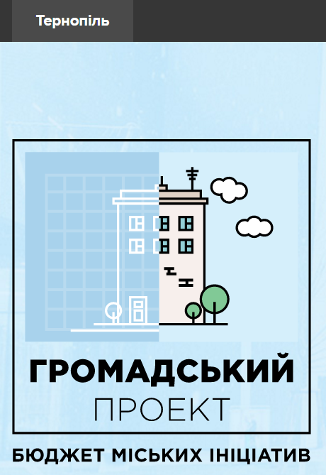

У м. Тернопіль проект бюджету участі реалізується за допомогою платформи
Громадський проект[21]. У 2017-му році на реалізації міської ради буде знаходитися 15 проектів.

7 проектів із 15-ти направлені на розвиток спорту у місті: проекти «Будівництво
парку для велосипедних змагань (МТБ-парк)», «Створення тренувального майданчику
військово- тактичного характеру», «Створення соціальної мультиспортивної зали»,
«Спортивна туристизація Тернополя», «Спорядження для дітей та дорослих ГО «СТК
«ЛЕГІОН»», «Встановлення вуличних спортивних тренажерів», «Облаштування вуличних
тренажерів у Старому парку», «Облаштування спортивно-ігрового майданчика по вул.
М.Кривоноса».

3 проекти-переможці будуть реалізовані у сфері комунального господарства:
протекти «Чисті парки – радість для кожного», «Ремонт комунального приміщення
громадської організації», «Дитячі майданчики на території дитсадка для мешканців
м-н «Канада»». 2 проекти у сфері культури: «Мистецький фестиваль «Ї»»,
«Молодіжний Центр – відкрита платформа для комунікації, навчання та втілення
проектів». Тільки 1 проект в освітянській сфері – «Науково-демонстраційний
освітній центр «Центр Науки»» та 1 проект у сфері е-врядування, а саме:
впровадження системи надання адміністративних послуг через Електронний портал.

Кожен житель міста може подати свій проект онлайн, проголосувати за проект можна
також онлайн. Реалізація ж проекту покладається на міську раду.

Варто зазначити, що кожне місто самостійно, за допомогою локальних
нормативно-правових актів, регулює питання подальшої реалізації проектів. У
деяких містах, наприклад Кривий Ріг – проекти реалізуються безпосередньо
авторами проектів (фізичними особами чи громадськими орга- нізаціями), а у
Тернополі – реалізація проектів покладається на міську владу.

Громадський бюджет м. Кривий Ріг працює з квітня 2016 року, відповідно до
рішення міської ради «Про проведення конкурсу проектів місцевого розвитку
«Громадський бюджет»»[22].

За результатами проведеного конкурсу у 2016 році 99 проектів було подано на
конкурс. Практично половина поданих проектів, а саме 46 проектів здобули
перемогу та будуть впроваджені протягом 2017-го року. Голосування за проекти
відбувалося онлайн на веб-сторінці Громадського бюджету та у пунктах
голосування, які були розташовані у всіх районах міста (у приміщеннях виконкомів
районних у місті рад). На реалізацію проектів- переможців у 2017-му році з
місцевого бюджету буде виділено 15 млн. гривень.

Проекти-переможці криворіжців направлені на: встановлення пластикових вікон у
школах та лікарнях міста (усього 15 проектів); створення спортивних майданчиків,
місць для відпочинку (10 проектів, включаючи поле для міні-футболу, стріт-болу,
мобільного баскетболу, мистецькі простори під відкритим небом); підтримка та
розвиток інклюзивної освіти у місті (2 проекти); проекти спрямовані на розвиток
освіти (2 проекти: створення Центру інформаційної освіти та Центру «Юний
хакер»); встановлення індиві- дуальних теплових пунктів (2 проекти); створення
музею бойової слави (1 проект) та інші.

У м. Ірпінь за сприяння Фундації польсько-української співпраці ПАУСІ у рамках
Польсько-Канадської Програми Підтримки Демократії співфінансованої з програми
польської співпраці на користь розвитку Міністерства закордонних справ
Республіки Польща та канадського Міністерства закордонних справ, торгівлі та
розвитку (DFATD) стартувала міська цільова програма «Громадський бюджет м.
Ірпінь». Голосування за проекти проводилось за допомогою системи «Громадський
бюджет», що створена також в рамках Програми EGAP[23].

У конкурсі на отримання фінансування за рахунок бюджету міста змагалося усього
68 проектів. Цілеспрямованість проектів, як і у попередніх містах України була
різною. За результатами конкурсу переможцями визнано 13 проектів, які набрали
від 30 до 481 голосів та спрямовані на: благоустрій зони відпочинку (Фонтан на
Університетській), створення сучасного інформаційного центру для усіх груп
населення, у тому числі, з особливими потребами; встановлення у будівлях шкіл
камер відео-спостереження, систем пожежного сповіщення, оснащення
аудіо-апаратурою (3 проекти); розвиток спорту (6 проектів); проект, спрямований
на встановлення дефібриляторів в усіх громадських місцях; закупівля обладнання
для гуманного поводження з тваринами (1 проект). Загальна сума фінансування
проектів у м. Ірпінь становить 1 000 000 грн.

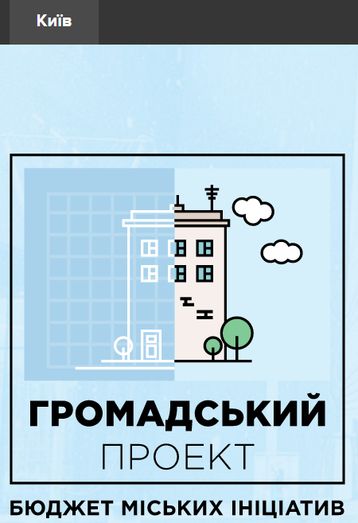

Місто Київ теж є зразком для України, завдяки розвитку власної учасницької
моделі та спроможність громади до самоуправління бюджетом участі, на відміну від
інших міст, які пішли шляхом лише конкурсу проектів. Більше того, у м. Києві
запроваджено 100% голосування за проекти онлайн. Завдяки волонтерській роботі
команди Kyiv Smart City механізм громадського бюджету став дійсно демократичним,
інноваційним та ефективним для Києва.

На пілотне впровадження у 2017 році Київ виділив 50 млн. грн. (до 1 млн. грн. на
1 проект) і далі цю суму громадського бюджету планується збільшувати.
Відвідування киянами сайту проектів склало за січень понад 200 тисяч осіб. Із
них, проголосувало більше 50 тисяч киян – це рекордна активність для України.
Вже узгоджено порядок підготовки до реалізації топ- 62 проектів-переможців та
відповідальних за них розпорядників бюджетних коштів.

Враховуючи аналіз громадського бюджету у містах України, можемо зробити
висновок, що громадський бюджет участі – важливий інструмент участі у розподілі
коштів місцевого бюджету. Городяни кожного з міст використовують можливості
громадського бюджету участі на свій розсуд, віддаючи перевагу тим проектам, які
вирішують нагальні для міста питання. Саме ініціативи такого рівня дають
можливість громаді відчути себе причетними до управління місцевими справами та
до фінансування тих сфер діяльності міста, які цього потребують.

[14]: Плоский К. Партисипативний бюджет – це не так про міські гроші, як про довір’я [Електронний ресурс]. / Костянтин Плоский. 2017. – Режим доступу: https://biggggidea.com/practices/1494/  
[15]: Василиця О. Партисипативне бюджетування: чого від нього можна чекати? [Електронний ресурс]. / Оксана Василиця. 2017. – Режим доступу: http://spm.ucu.edu.ua/2016/09/30/partysypatyvne-byudzhetuvannya-chogo-vid-nogo-mozhna-chekaty/  
[16]: Василиця О. Партисипативне бюджетування: чого від нього можна чекати? [Електронний ресурс]. / Оксана Василиця. 2017. – Режим доступу: http://spm.ucu.edu.ua/2016/09/30/partysypatyvne-byudzhetuvannya-chogo-vid-nogo-mozhna-chekaty/  
[17]: Закон України «Про місцеве самоврядування в Україні» [Електронний ресурс]. –Режим доступу: http://zakon2.rada.gov.ua/laws/show/280/97-%D0%B2%D1%80/page  
[18]: ПАУСІ [Електронний ресурс]. – Режим доступу: http://www.pauci.org/open_project.php?id=22  
[19]: Бюджет участі в місті Житомирі [Електронний ресурс]. – Режим доступу:  http://gromada.zt-rada.gov.ua/rezultaty-i-golosuvannya/rezultati-golosuvannya-2016-roku/  
[20]: Єгорова А. Оприлюднені результати голосування за проекти «Бюджету участі» [Електронний ресурс]. – Режим доступу: https://tribuna.pl.ua/news/oprilyudneni-rezultati-golosuvannya-za-proekti-byudzhetu-uchasti/  
[21]: Громадський проект. Бюджет міських ініціатив. [Електронний ресурс]. – Режим доступу:  https://pb.rada.te.ua  
[22]: Офіційний сайт виконкому Криворізької міської ради.  [Електронний ресурс]. – Режим доступу:  http://gb2016.kr.gov.ua/informatsiya_pro_konkurs  
[23]: Громадський бюджет. Ірпінь. [Електронний ресурс]. – Режим доступу: http://initiativ.e-dem.in.ua/irpin  

3.3. Платформи е-участі

*Поліна Завадська*

Більшість платформ е-участі в Україні мають на меті полегшення комунікації
влада-громадянин і часто пов’язані із впровадженням інструментів е-демократії.

**Smart City**

*Smart City* – це концепція взаємодії міської влади, бізнесу і суспільства задля
розвитку «розумної» інфраструктури міста на основі впровадження технічних,
управлінських та суспільних інновацій. На сьогодні найбільш комплексно, наочно
і результативно ідея [Smart City](https://www.kyivsmartcity.com/) реалізовується
у Києві.

Концепцією Kyiv Smart City (KSC) 2020 визначено наступні напрями розвитку міста:

-   підвищення якості життя містян;
-   модернізація фізичної та розбудова технологічної інфраструктури міста;
-   використання технологій для ефективного управління містом;
-   дотримання стандартів екологічності, сталого економічного розвитку та
    соціальної інклюзії;
-   активне залучення громадян.

Платформа реалізує цілий ряд проектів у різних сферах, починаючи від
smart-вулиці і Living Lab Kyiv, й закінчуючи бюджетом участі.

Для консолідації міських активістів було запущено Kyiv Smart City Hub, що став
базою для інших успішних проектів. Одним із них є інкубатор Kyiv Smart City –
київський інкубатор міських проектів.

KSC займається також освітньо- просвітницькою діяльністю. Зокрема, функціонує
школа Kyiv Smart City School, яка пропонує такі курси, як «Технології та
інновації», «Культура міста», «Електронна демократія», «Урбанізм», «Суспільне
управління проектами» тощо.

Продовжує свою роботу й Академія програмування – безкоштовна освітня програма
для дітей шкільного віку.

Спроби запровадити ініціативу Smart City були зроблені у Львові. В листопаді
2015 р. у місті за підтримки Львівської міської ради відбулась відкрита
стратегічна сесія Lviv Smart City Day. На заході було представлено шість
панелей: Safe City, Smart Mobility, Smart Education, Smart Energy, E-Health,
Creative Hubs, однак на сьогодні запропонований Smart-формат так і не
реалізовано.

У Рівному також виникала ініціатива втілення концепції «розумного міста» за
київським зразком. До проекту «Rivne Smart City» захотіла долучитись міська
влада, у березні 2016 року вона підписала Меморандум про співпрацю із
активістами ГО «Простір». Заявлені цілі проекту, такі, як створення єдиного
міського Інтернет-порталу Рівного, поки що не досягнуті.

Наприкінці липня 2016 р. було засновано Hi-Tech Office Ukraine, при якому працює
експертна група зі Smart City. Вона планує розробку рамкового документу, що
слугував би орієнтиром для українських міст на шляху до впровадження стандартів
Smart City.

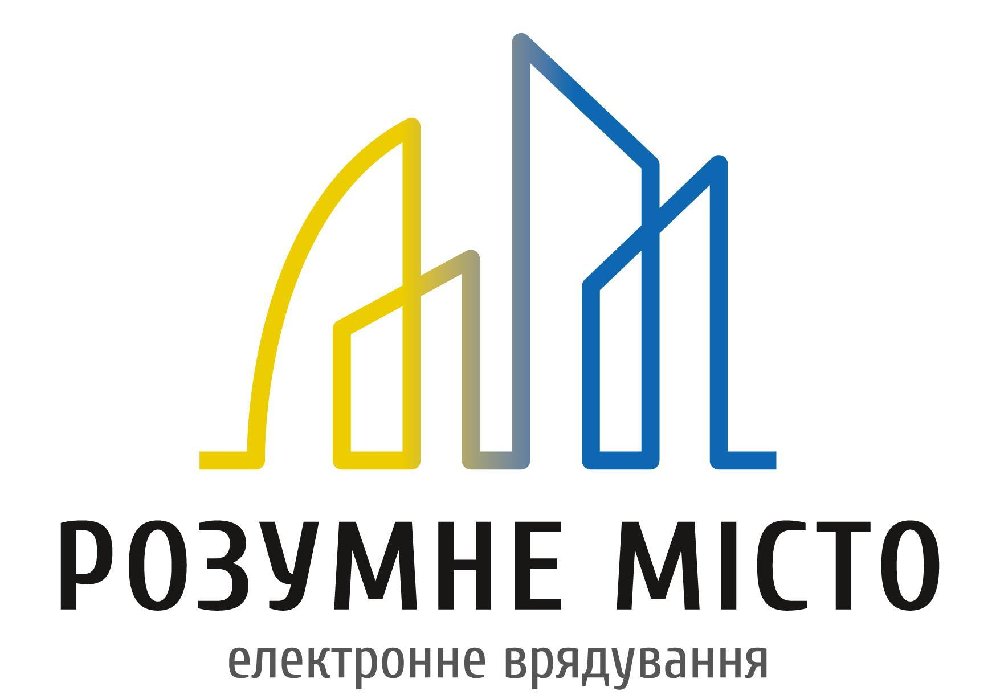

**Розумне місто**

На загальнонаціональному рівні ідея Smart City знайшла своє втілення у
комплексному пакеті інструментів «Розумне місто».

*Концепція*

[«Розумне місто»](http://www.rozumnemisto.org/)[25] – це
електронна платформа, що пропонує містам активацію обраних сервісів, які
сприяють самоврядуванню з одного боку, і ефективному е-урядуванню – з іншого.
Особливість порталу полягає у великому асортименті попередньо розроблених
е-інструментів та можливості підлаштування їх масиву під конкретний населений
пункт.

*Законодавча база*

Ключовим законодавчим актом, що створює основу для концепції порталу, є Закон
України «Про доступ до публічної інформації»[26], зокрема, ст. 10 «Публічна
інформація у формі відкритих даних».

Окремі сервіси (наприклад, електронні петиції) використовують спеціалізоване
законодавче підґрунтя, однак воно також виступає орієнтиром, а не регулятором.

Для підключення міста до сервісів порталу між ГО «Розумне місто» та
представником місцевої влади підписується меморандум про співпрацю.

*Механізм*

«Розумне місто» налагоджує співпрацю із органами влади зацікавлених населених
пунктів, проводить безкоштовне навчання для кількох співробітників і формує
пропозицію із тих інструментів, які матимуть попит у місцевих громад.

На сьогодні доступними є такі мікросервіси, як новини міста, дефекти ЖКГ,
петиції, відкритий бюджет, відкриті фінанси, опитування, електронні послуги
«iGov», електронні закупівлі «ProZorro», донорство крові, реєстр ліків, черги на
житло, розумні дороги. У розробці знаходиться розділ «бюджет участі», і
планується також впровадження мікросервісів «розшук поліції», «енергозбереження»
та «аукціон державного майна».

Конкурентною перевагою порталу є саме інтеграція усіх необхідних інструментів
е-участі, якої бракує схожим платформам.

Водночас проект пропонує й інші бонуси, які мають приваблювати нових активістів.
Так, кожен зареєстрований користувач має свій профіль, у якому відображається
персональна карма – показник соціальної активності.

*Поширення*

Станом на 31 січня 2017 року до платформи приєдналися 63 населених пункти. Їх
повний перелік доступний [за посиланням](http://www.rozumnemisto.org/map).

*Результати*

Проект було запущено 1 лютого 2016 року. Тестовим «розумним містом» став Нетішин
(Хмельницька область). Менш ніж за рік роботи сервісу до нього підключилось
понад 5000 користувачів.

«Розумне місто» позиціонується як комплексний електронний сервіс для невеликих
міст, який пропонує достатньо широкий набір інструментів. Проте, місцева влада у
містах і містечках часто виявляється неспроможною одночасно запустити і якісно
використовувати більше 2-3 електронних сервісів порталу.

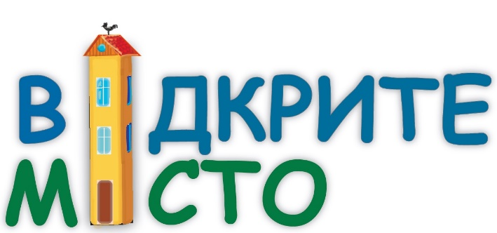

Відкрите місто[27]

*Концепція*

Проект «[Відкрите місто](http://opencity.in.ua/#r=UA)» – це електронна
платформа, що дозволяє мешканцям міст комунікувати з місцевими органами влади і
комунальними підприємствами та в інтерактивному режимі висувати пропозиції щодо
покращення благоустрою і вирішення нагальних проблем міста. На сайті також
розміщується офіційна інформація для громадян і наповнюється карта із корисними
об'єктами.

*Законодавча база*

Базовим підґрунтям для проекту є Закон України «Про звернення громадян»[28], яким у ст. 5
передбачено можливість надсилання електронного звернення. Варто зауважити, що у
даному випадку звернення, оформлене на порталі, не вважатиметься офіційним.
Проте робота місцевих органів влади з цим порталом регулюється нормативно-
правовими актами, що приймаються відповідною радою.

*Механізм*

Кожен, хто реєструється на порталі, має можливість повідомити про наявну міську
проблему у розділі «Проблеми і рішення». Для цього потрібно позначити на карті
те місце, на яке мають звернути увагу відповідні установи чи організації,
описати суть проблеми і вказати, яке рішення очікується. Після розгляду
звернення (не пізніше, ніж на третій день після його публікації) відповідальний
орган зобов'язаний публічно проінфор- мувати заявника про результат його
опрацювання і поточний стан справи.

Мешканці можуть не тільки ініціювати вирішення міських проблем, але й отримувати
важливі повідомлення про життя міста і функціонування окремих служб у розділі
«Офіційна інформація». Підписавшись на оновлення цього розділу, можна також
отримувати усі новини на електронну пошту. Додатковим бонусом порталу є карта,
на яку користувачі наносять підказки щодо корисних об'єктів.

*Поширення*

Учасниками проекту вже стали 46 міст України, більшість із них – обласного
значення. На сьогодні не представленими залишаються Київ, Житомирська,
Кіровоградська, Мико- лаївська, Харківська, Луганська і Донецька області, і
тимчасово окупована АР «Крим». Карту підклю- чених міст можна переглянути
[тут](http://opencity.in.ua/team#r=UA80).

*Результати*

За даними сайту, станом на 31 січня 2017 року вирішено 9153 проблеми.

На базі проекту створено Асоціацію відкритих міст.

**Контакт-центри міст для звернень громадян**

*Законодавча база*

Функціонування контакт-центрів міст регулюється Законами України «Про звернення
громадян» та «Про доступ до публічної інформації» і належить до сфери управління
вико- навчих органів міських/обласних рад.

Постановою Кабінету Міністрів України від 18 січня 2012 р. було затверджено
Положення № 21 про Національну систему опрацювання звернень до органів
виконавчої влади, а також Типове положення про контактний центр.

Більшість українських контактних центрів для подання громадянами звернень до
місцевої влади у телефонному режимі переросла в електронні платформи участі
після створення відповідних Інтернет- порталів та додавання електронної форми
для звернень.

Розглянемо найвдаліші приклади місцевих контактних центрів.

[Київський контактний центр «1551»](http://1551.gov.ua/)

Київський кол-центр «1551» переріс у зручний Інтернет-портал після виникнення
потреби у платформі для електронних звернень.

Для того, щоб залишити звернення на сайті, потрібно зареєструватись. Текст
звернення не має перевищувати 2500 символів.

Окрім того, користувач має можливість вказати координати місцезнаходження
проблеми на карті. На ній відображаються і звернення, отримані через мобільний
додаток. Відстежувати статус та хід розгляду звернень можна в особистому
кабінеті.

Портал містить також так звану «Базу знань» – базу даних, що містить
систематизовану інформацію з різних сфер життєдіяльності Києва:

-   житлово-комунальне господарство;

-   транспорт;

-   охорона здоров'я;

-   житлове забезпечення;

-   реклама;

-   торгівля;

-   освіта;

-   сім'я, молодь та спорт;

-   зв'язок та інформація;

-   соціальне забезпечення.

*Єдиний центр звернень громадян Одеської міської ради «1535»*

Усі публічні звернення для зручності пошуку занесені у каталог за тематичними
категоріями:

-   спортивні майданчики;

-   дворові території;

-   багатоквартирні будинки;

-   дороги;

-   поліклініки, здоров'я;

-   школи, дитсадки, освіта;

-   парки;

-   торгові кіоски;

-   пляжі;

-   освітлення;

-   опалення;

-   водопостачання тощо.

На сайті розміщена карта звернень, яка містить локації, пов'язані із новими
зверненнями, зверненнями, що наразі опрацьовуються, та зверненнями з
відповідями. Особливістю порталу є розділ «До/після» із наочним представ- ленням
впроваджених змін, ініційованих у зверненнях.

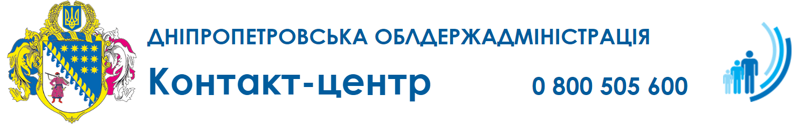

*Контакт-центр голови Дніпропетровської облдержадміністрації*

Як і на попередніх порталах, подання звернення вимагає попередньої реєстрації.
На сайті є інтерактивна карта, а також інформаційний центр з великою базою
статистичних даних по зверненнях, що надійшли до контакт-центру і були ним
опрацьовані.

Звернення до Дніпропетровської обласної державної адміністрації, що надходять в
електронній формі, приймаються і надсилаються до територіальних органів
виконавчої влади, районних державних адміні- страцій, структурних підрозділів
облдержадміністрації, органів місце- вого самоврядування, підприємств, установ
та організацій комунальної форми власності; також відбувається інформування
заявників щодо норм законодавства, надання необхідних консультацій і
роз’яснень[29].

На сайті Вінницької міської ради відправити звернення можна персо- нально: до
міського голови, його заступників, директорів департаментів та начальників
відділів міської ради. Втім, окремого порталу для звернень у Вінниці немає.

Однак, на цьому ресурсі мешканці в режимі онлайн можуть ознайомитися зі
статистикою ЦАП «Прозорий офісу», зокрема, про: кількість людей у черзі в даний
момент, періоди найбільшого чи найменшого завантаження, найбільш затребувані
адміністративні послуги, історію просування черги; також можна перевірити стан
розгляду дозвільної процедури. Також є можливість дізнатися про громадські
обговорення.

На окрему увагу заслуговують *громадські платформи е-участі.*

Наприклад, соціальний проект спільної дії [«Зробимо
разом»](http://zrobymorazom.com/) передбачає об’єднання зусиль київської міської
влади, представників бізнесу та громади міста заради створення комфортного
середовища для мешканців і гостей Києва, підвищення якості життя у столиці.

Іншим показовим інструментом є [Civil Society App](https://gurtom.mobi/), який
надає можливість на підставі доповненої реальності та згенерованих громадянами
даних визначати проблеми, приймати та реалізовувати спільні рішення для
підвищення якості життя громадян.

Проект «[Мій Голос](https://miygolos.org.ua/)» – це незалежна платформа
громадянських ініціатив, за допомогою якої кожен громадянин України може
оприлюднити свою ініціативу і збирати підписи для її передачі в Адміністрацію
Президента, Верховну Раду чи Кабінет Міністрів. Для надійності, персональні дані
тих, хто голосує, верифікуються системою ідентифікації BankID.

[25]: На етапі розробки проект фінансувався самими розробниками - ІТ-фахівцями з міста Вараш, Євгеном та Євгенією Поремчуками. Згодом його було передано ГО «Razom for Ukraine». Ресурсами допомагають також Google, Microsoft, IRI та JetBrains.  
[26]: Закон України «Про доступ до публічної інформації» [Електронний ресурс]. – Режим доступу: http://zakon2.rada.gov.ua/laws/show/2939-17  
[27]: Проект створений за ініціативи Фонду Східна Європа і фінансується Фондом Ч.С. Мотта. Окрім того, енергетична компанія ДТЕК надала фінансову підтримку для запуску проекту у тих містах, де вона веде свою діяльність.  
[28]: Закон України «Про звернення громадян» [електронний ресурс]. – Режим доступу: http://zakon3.rada.gov.ua/laws/show/393/96-%D0%B2%D1%80  
[29]: Правила роботи порталу Дніпропетровського обласного контактного центру e-contact.dp.gov.ua [Електронний ресурс]. – Режим доступу: https://e-contact.dp.gov.ua/files/docs/Pravila.docx  

 
3.4. Інші інструменти е-участі
------------------------------

*Анна Ємельянова*

Право на участь в управлінні державними справами, закріплено у ст. 38
Конституції України[30] і є відповідною гарантією кожного обирати та бути обраним, брати участь у
всеукраїнському та місцевому референдумах, гарантує рівне право доступу до
державної служби. Із плином демократизаційних процесів в Україні, розвитком
інформаційно-комунікативних технологій саме поняття «участі в управлінні
державними справами» набуло інакшого забарвлення та стало помітно ширшим
поняттям. Участь в управлінні державними справами, що беззаперечно включає у
себе і участь в управлінні місцевими справами стала більш доступним та
розповсюдженим явищем.

Участю у державних справах, на разі, називають усі можливі прояви впливу
індивіда, громади на прийняття тих чи інших рішень, нормативно- правових актів
органами державної влади чи місцевого самоврядування; внесення ініціативи щодо
прийняття, відміну чи скасування певних прийнятих рішень органами місцевого
самоврядування та/чи органами державної влади; проектування законів; участь у
розподілі коштів місцевих бюджетів; громадське обговорення положень, що
приймаються на містах; громадська експертиза проектів рішень, місцеві
ініціативи, петиції та інше.

Враховуючи, що участь в управлінні місцевими та державними справами стала більш
доступною для представників різних верств населення завдяки активному
впровадженню інформаційно-комунікативних засобів, веб-платформ, веб-ресурсів, то
і інструменти участі в управлінні державними й місцевими справами зазнали певної
трансформації. Наразі, активні громадяни використовують е-звернення, е- петиції,
е-обговорення, та е-бюджети участі.

На нашу думку, усі процеси, які законодавчо вимагають для своєї реалізації
підписних листів, наприклад, громадські ініціативи і у більшості міст України
громадські обговорення – повинні бути переведені у онлайн площину, що суттєво
знизить корупційну складову, організаційні зусилля учасників та підвищать
прозорість процесу. Пропонуємо розглянути е-інструменти, які вже наявні і
користуються попитом серед представників українського суспільства.

**Е-звернення**

Право на звернення – гарантоване ст. 40 Конституції України[31] право
кожного звернутися до органів державної влади, місцевого само- врядування їх
службових та посадових осіб із письмовим чи усним, індивідуальним чи колективним
зверненням та отримати на нього відповідь у встановлені строки. Стаття 1 закону
України «Про звернення громадян»[32] детальніше
розкриває коло суб’єктів, до яких можна звернутися та яким можна звертатися. До
органів державної влади, місцевого самоврядування, об'єднань громадян,
підприємств, установ, організацій незалежно від форм власності, засобів масової
інформації, посадових осіб відповідно до їх функціональних обов'язків із
зауваженнями, скаргами та пропо- зиціями, що стосуються їх статутної діяльності,
заявою або клопотанням щодо реалізації своїх соціально- економічних, політичних
та особистих прав і законних інтересів та скаргою про їх порушення мають право
звертатися усі, хто на законних під- ставах перебуває на території України.

Видами звернень є подані у письмовій чи усній формі: пропозиції (зауваження)
заяви (клопотання) та скарги. У зверненні має бути зазначено прізвище, ім’я, по
батькові, місце проживання громадянина, викладено суть порушеного питання,
зауваження, пропозиції, заяви чи скарги, прохання чи вимоги. Письмове звернення
повинно бути підписано заявником (заявниками) із зазначенням дати.

Звернення стає електронним зверненням чи е-зверненням у разі, коли письмове
звернення подається «з використанням мережі Інтернет, засобів електронного
зв’язку».

Вищезазначене означає, що до органів державної влади та місцевого самоврядування
звернення можна надсилати в електронній формі за допомогою електронних адрес,
вказаних на офіційних сайтах органів державної влади та місцевого
самоврядування. У випадку відсутності спеціальних адрес для звернень, звернення
надсилаються на загальну електронну пошту органу чи за допомогою відповідної
форми для звернень, що міститься на офіційному веб-сайті відповідного органу
державної влади чи органу місцевого самоврядування.

В електронному зверненні заявнику слід зазначити також електронну адресу, на яку
необхідно надіслати відповідь або інші засоби зв’язку. Наявність у заявника
електронного цифрового підпису не вимагається.

Для зручності, деякі міста, створили в мережі Інтернет окремі спеціальні Центри
звернень, віртуально відвідавши які, можна подати звернення й перевірити стан
його виконання: [Одеса](http://www.1535.odessa.ua/),
[Львів](http://www.city-adm.lviv.ua/services/application), [Івано-
Франківськ](http://www.emvk.if.ua/ezvern),
[Суми](http://www.cnap.gov.ua/node/18), [Кривий
Ріг](https://krogerc.info/ua/komcentr/register/komcentr.html),
[Ужгород](C:\www.city-adm.rv.ua\RivnePortal\ContentPages\Public\wroom.aspx) та
інші міста. Послугами таких платформ, на жаль, користуються не в усіх, навіть
великих, містах України. Окрім того, варто зазначити, що в Україні було створено
[Державну систему електронних звернень](http://www.z.gov.ua/) – єдиний
інформаційний веб-ресурс звернень громадян до органів державної влади та органів
місцевого самоврядування.

Розробники запевняють, що для створення «юридично значимого» звернення необхідно
мати електронний цифровий підпис, з чим важко погодитися.

**Е-громадські обговорення**

Громадське обговорення законо- проектів та проектів рішень є надзвичайно
важливим елементом відкритості влади та сприяє більш якісному діалогу між
органами державної влади та громадянським суспільством.

На виконання рекомендацій Місії Європарламенту щодо внутрішньої реформи і
підвищення інституційної спроможності Верховної Ради України парламентськими
службами спільно з Програмою USAID РАДА розроблено спеціальний парламентський
ресурс - «Портал громадського обговорення законопроектів»[33]. Зараз
на обгово- ренні знаходиться два законопроекти, щодо яких Комітет Верховної Ради
України з питань правової політики та правосуддя було визначено головним з їх
опрацювання: проект Закону про лобізм та проект Закону про лобіювання. Взяти
участь в обгово- ренні можна за
[посиланням](https://itd.rada.gov.ua/services/pubd/).

Важливо зазначити, що громадське е-обговорення законопроектів та
нормативно-правових актів в Україні існує вже декілька років. Міністерство
освіти і науки України, наприклад, постійно на офіційному веб-сайті (у вкладенні
Електронні консультації з громадськістю) проводить громадські обговорення.
Кожен, хто має пропозиції до проектів законів, розпоряджень, може надіслати свої
пропозиції до відповідального виконавця[34]. [Міністерство Юстиції України](http://old.minjust.gov.ua/50602)
й [Міністерство соціальної політики](http://www.msp.gov.ua/) України на офіційних веб-сайтах у вкладенні Електронні консультації з
громадськістю також публікують проекти нормативно-правових актів, проте чіткої
інформації щодо способу надання пропозицій громадськістю до проектів чи емейл
відповідальної особи такі повідомлення не містять.

Окрім того, громадські обговорення відбуваються не лише на національному рівні,
а й у містах. Київська міська державна адміністрація постійно проводить
[громадські обговорення](http://projects.kievcity.gov.ua/) проектів нормативно-
правових актів: до 18.01.2017 року тривало обговорення щодо присвоєння вулиці
Проектна 12810 у Голосіївському районі міста Києва назву вулиці Назарія
Яремчука; до 26.01.2017 року тривало обговорення проекту рішення Київської
міської ради «Про затвердження міської цільової програми правової освіти
населення міста Києва на 2017-2019 роки»; до 22.02.2017 року буде тривати
обговорення проекту розпорядження виконавчого органу Київської міської ради «Про
внесення змін до Тарифів на платні послуги з медичного обслуговування, які надає
Комунальне некомерційне підприємство «Консультативно-діагностичний центр дитячий
Дніпровського району м. Києва» та інші. Загальна кількість проектів
нормативно-правових актів, яка обговорювалася – 294; усього зареєстровано 28511
користувачів; надано 6336 редакцій нормативно- правових актів чи пропозицій до
них.

У м. Полтава у 2015 року на [е-громадське обговорення](http://www.citylab.org.ua/36-poltava-cycling-strategy.html) було
винесено проект Концепції розвитку велоінфраструктури міста Полтави на 2016-
2020 роки.

**Е-громадські слухання**

Громадські слухання є обов’язковою процедурою, яка проводиться під час розробки
проектів містобудівної документації на місцевому рівні: генеральних планів
населених пунктів, планів зонування та детальних планів територій. Така умова
передбачена Порядком проведення громадських слухань щодо врахування громадських
інтересів під час розроблення проектів містобудівної документації на місцевому
рівні, затвердженим Постановою Кабінету Міністрів України від 25 травня 2011 р.
№ 555[35].

Громадські слухання обов’язково проводяться у містах у разі внесення змін до
проектів містобудівної документації. Дуже часто, такі слухання проводяться лише
у формі засідань та зборів, що унеможливлює впровадження е-компоненти, а саме
надсилання пропозицій за допомогою електронної пошти. Такими містами, наприклад
є: Бровари, Запоріжжя, Здолбунів, Львів, Луцьк, Харків. Проте деякі виконавчі
комітети міст, наприклад Дніпро, Київ, Кривий Ріг, Тернопіль передбачили
можливість надсилання пропозиції на електронну адресу відповідальної особи.

На жаль, нормативна база, яка регулює порядок проведення громадських слухань
обмежується Постановою Кабінету Міністрів України № 555. З одного боку, це дає
можливість органам місцевого самоврядування затверджувати такі положення, які
будуть максимально ефективно працювати у певній адміністративно-територіальній
одиниці.

З іншого боку – це величезна шпарина для унеможливлення подальшої участі громади
у громадських слуханнях через складну процедуру їх скликання, прописану у
Положеннях. Відповідно до Положень про громадські слухання, наприклад у Вінниці
та Києві, городянам пропонується збирати підписні листи для того, щоб ініціювати
громадські слухання, що є типовою ситуацією і для інших міст України. Метою ж
слухань відповідно до затверджених Положень є, наприклад, «забезпечен- ня
зворотного зв’язку у вигляді ознайомлення громадськості з позицією міської влади
щодо актуальних проблем, отримання від членів громади міста пропозицій та
зауважень з нагальних питань у формі безпосереднього спілкування» чи «вироблення
взаємоприйнятних шляхів розв’язання проблем через вільне обговорення різних
точок зору учасників»[36] що явно не відповідає вищезазначеним процедурам.

*Е-громадські слухання* ще досі є складною та довготривалою процедурою для
реалізації громадянами. Враховуючи темпи розвитку е- демократії в Україні, на
нашу думку, доцільніше перевести громадські слухання у частково електронну
форму: не збирати підписні листи, вести електронний прийом заяв та звернень,
пропозицій щодо ініціативи та пропозицій для обговорень.

Основним в усіх інструментах участі, на нашу думку, є їх доступність і
прозорість. Саме за допомогою доступних і прозорих інструментів можна ефективно
впливати на стан та розвиток міста й держави.

[30]: Конституція України [Електронний ресурс]. – Режим доступу:  http://zakon3.rada.gov.ua/laws/show/254%D0%BA/96-%D0%B2%D1%80  
[31]: Конституція України [Електронний ресурс]. – Режим доступу:  http://zakon3.rada.gov.ua/laws/show/254%D0%BA/96-%D0%B2%D1%80  
[32]: Закону України «Про звернення громадян» [Електронний ресурс]. – Режим доступу: http://zakon3.rada.gov.ua/laws/show/393/96-%D0%B2%D1%80  
[33]: У Верховній Раді відбувається тестування інформаційного ресурсу «Портал громадського обговорення законопроектів» [Електронний ресурс]. – Режим доступу: https://www.auc.org.ua/novyna/u-verhovniy-radi-vidbuvayetsya-testuvannya-informaciynogo-resursu-portal-gromadskogo  
[34]: Громадське обговорення - 2016 [Електронний ресурс]. – Режим доступу: http://mon.gov.ua/citizens/zv%E2%80%99yazki-z-gromadskistyu/konsultacziyi-z-gromadskistyu/gromadske-obgovorennya-2016.html  
[35]: Постанова Кабінету Міністрів України [Електронний ресурс]. – Режим доступу: http://zakon3.rada.gov.ua/laws/show/555-2011-%D0%BF  
[36]: Положення про громадські слухання в місті Вінниці [Електронний ресурс]. – Режим доступу: http://www.vmr.gov.ua/TransparentCity/ContentLibrary/962bed5e-90d9-4ed7-9661-fbd07d109688/1/%D0%9F%D0%BE%D0%BB%D0%BE%D0%B6%D0%B5%D0%BD%D0%BD%D1%8F%20%D0%BF%D1%80%D0%BE%20%D0%B3%D1%80%D0%BE%D0%BC%D0%B0%D0%B4%D1%81%D1%8C%D0%BA%D1%96%20%D1%81%D0%BB%D1%83%D1%85%D0%B0%D0%BD%D0%BD%D1%8F.pdf  

# 4. Особливості використання інструментів е-демократії у містах України

*Дмитро Хуткий*

4.1. Онлайн і офлайн формати
----------------------------

При використані цифрових інструментів, варто знати і про офлайн аналоги. Адже
демократичні інституції найефективніші, коли поєднуються і онлайн, і офлайн
компоненти[37]. Наприклад, громадські
слухання, за наявності відповідної ІТ платформи[38], провести онлайн легше і швидше;
однак, особисті зустрічі представників влади із громадою можуть бути більш
вагомими. На це є декілька причин: більшість українців досі надають перевагу
особистому спілкуванню, у порівнянні зі спілкуванням онлайн; далеко не всі
мешканці мають доступ до Інтернету чи просто ним не користуються для взаємодії з
владою, особливо люди старшого віку, з меншим рівнем освіти, та у менших
населених пунктах[39], тому можуть взяти участь лише особисто.

Однак, офлайн участь має свої обмеження: для досягнення кворуму є потреба
залучити критичну кількість людей в один час; для продуктивності необхідно
обговорювати питання і висловлюватися по черзі; також потрібно використовувати
паперові документи для фіксації результатів.

Однак, інструменти онлайн участі мають свої *переваги*: гнучкість у плані часу і
місця доступу, адже не потрібно збирати всіх в одному місці і в один час;
можливість одночасного обгово- рення кількох питань багатьма людьми (наприклад,
на онлайн форумі з кількома гілками); моментальна фіксація дискусії; максимальна
прозорість обговорень і голосувань тощо.

Звісно, цифровий формат має і свої *ризики*: менша залученість старшого
покоління та мешканців сіл; деякий елемент недовіри; ризик зловживань
модераторами чи адміністраторами. Саме тому найкраще поєднувати онлайн і офлайн
версії інструментів демократії, або, в разі якщо якогось онлайн інструменту
бракує, використовувати традиційний офлайн формат. З часом частка користувачів
Інтернету та користувачів онлайн сервісів збільшується, тому їх запровадження є
перспективним і далекоглядним.

[37]: Хуткий Д. Ефективна учасницька демократія: модель реальної утопії = Efficient Participatory Democracy: Real Utopia Model / Дмитро Хуткий. – Медісон, 2016. – 30 с. – (Препринт / Університет Вісконсіна-Медісон). – Режим доступу: http://havenscenter.org/files/Khutkyy%202016%20Efficient%20Participatory%20democracy.pdf  
[38]: Наприклад, розробленої ГО «Електронна демократія» http://ed.org.ua  
[39]: КМІС. Е-уряд та е-демократія: що думають українці? / КМІС. – К.: 2015. – 12 с.  

4.2. Взаємодія громадськості, бізнесу та влади
----------------------------------------------

На сьогодні, представники влади переважно обмежуються інструментами прозорості,
зокрема, веб- сайтами для інформування. Однак, у громадськості назрів запит на
більш просунуті інтерактивні інструменти е- демократії і є бажання ширше їх
використовувати[40]. Тому активісти громадянського суспільства розробляють і
пропонують низку цифрових інструментів, переважно з метою посилення підзвітності
та участі.

Одним із найпотужнішим способом налагодження діалогу між громадянами і владою є
участь у спільних проектах, від створення спільних правил до спільного втілення
проектів. Завдяки виконанню проектів, які спільно фінансуються органами місцевої
влади або місцевого самоврядування, представниками бізнесу, громадянами та
міжнародними організаціями, підвищується відчуття громадянами відкритості влади,
довіра до неї, а також сприйняття рівня співпраці та задоволеність роботою
представників влади[41].

Показовим успішним прикладом є місто Київ, де за останні два роки у плідній
співпраці з громадянським суспільством було запроваджено два дієвих інструменти
е-демократії. Сервіс е-петицій реалізований на окремій платформі, має десятки
успішних петицій, з яких 3 принаймні частково реалізовані владою.

Причому, Положення про роботу з е-петиціями напрацьовувалося представниками
Київської міської ради разом з активістами Центру розвитку інновацій НаУКМА й
авторами е-петицій. Громадський бюджет (по суті, бюджет участі) спочатку був
ініційований владою, але механізм його втілення був суттєво змінений завдяки
активності і в інтересах громадян – було забезпечено максимальну прозорість і
підзвітність влади та участь громадян. В результаті голосування мешканців міста
Києва, 62 проекти будуть реалізовані спільно.

[40]: Томкова Й. eДемократія в Україні: Погляди громадян і ключових зацікавлених сторін / Й. Томкова, М. Богуслав, Н. Гаращенко, С. Лобойко, О. Правило, А. Семенченко, Д. Хуткий. – К., 2016. – 76 с. – Режим доступу: http://egap.in.ua/wpcontent/uploads/2016/07/UKRAINIAN-Report-Open-Mic.pdf  
[41]: Хуткий Д.О. Оцінка впливу підходу до місцевого розвитку за участі громад у проектах  
[*]: ПРООН в Україні: результати соціологічного дослідження / Д.О. Хуткий // Місцевий розвиток за участі громади: монографія: у 2 т.
– Т. 1. Теоретичні основи становлення місцевого розвитку, орієнтованого на громаду / [за заг. ред. Ю.М. Петрушенка]. – Суми:
Університетська книга, 2013. – С. 305-337. – Режим доступу: http://www.ekmair.ukma.kiev.ua/bitstream/123456789/3392/1/Khutkyi_Otsinka_vplyvu_pidkhodu%20.pdf  

# Висновки

*Сергій Лобойко, Михайло Наход*

Поняття «електронна демократія» або «е-демократія», також «демократія участі» в
останні роки увійшли у широкий вжиток в Україні. Вони часто використовуються
представниками ЗМІ, органів державної влади та місцевого самоврядування,
громадськими активістами. Але як показують результати соціологічного опитування
проведеного КМІС напередодні 2016 року[42], 79 % українців ніколи не чули
терміну «електронна демократія» і лише 41 % частково розуміють його значення.
Проте, з широким впровадженням петицій ситуація за останні два роки помітно
покращилась.

У вузькому розумінні під терміном «електронна демократія» розуміють застосування
ІКТ (інформаційно- комунікаційних технологій) для забезпечення (електронного
супроводу) прав громадян. Відповідно до такого підходу, наприклад, традиційний
спосіб подання заяв, звернень, запитів від громадян до органам влади змінюється
на електронний та відкриває додаткові можливості чи зручності (контролю за
станом питання, швидкості зворотного зв’язку тощо.

Е-демократія у широкому розумінні передбачає залучення громадян до вирішення
різноманітних суспільно- політичних завдань за допомогою сучасних ІКТ.
Відповідно до цього підходу інструменти е-демократії дозволяють: посилити
участь, ініціативність та залучення громадян на національному, регіональному та
місцевому рівнях до публічного життя; покращити прозорість процесу прийняття
рішень, а також підзвітність демократичних інститутів; покращити зворотну
реакцію органів влади на звернення громадян; сприяти публічним дискусіям та
привертати увагу громадян до процесів прийняття рішень; швидше і якісніше
розвивати горизонтальні зв'язки та посилювати вплив громадськості на владу, її
рішення.

Впродовж останніх років інструменти е-демократії найбільш динамічно розвивались
на рівні саме органів місцевого самоврядування, насамперед міст. Серед широкого
спектру інструментів е-демократії найчастіше у містах використовують: відкриті
дані, у тому числі і відкриті бюджети; онлайн-трансляції пленар- них засідань
сесій та виконкомів; електронні консультації; громадські слухання онлайн;
е-голосування; розсилки корисної інформації; платформи взаємодії (контактні
центри); бюджети участі або громадські бюджети онлайн; та, як правило, найбільш
масовий - сервіс е- петицій. Останні три інструменти набули широкої популярності
в українських містах.

Сьогодні існує вибір між дорогими, дешевим і безкоштовним сервісами та
ІТ-рішеннями для міст. Звичайно вибір залежить від наявних ресурсів, але як
показує наше дослідження більшість міст віддає перевагу безкоштовним
інструментам і платформам («Єдина система місцевих петицій», «Розумне місто»,
«Відкрите місто»).

Більшість цифрових інструментів дозволяють забезпечити принаймні три виміри
демократичності органів влади: прозорість, підзвітність, участь. Саме за
допомогою доступних і прозорих інструментів можна ефективно впливати на стан та
розвиток міста й держави.

За останній рік виокремились міста-лідери з впровадження інструментів
е-демократії. Серед обласних центрів до їх числа можна віднести - Київ, Луцьк,
Львів, Дніпро, Чернівці, Хмельницький, Тернопіль, Івано-Франківськ, Харків.
Серед невеликих міст найбільш активними у впровадженні електронних інструментів
є Тростянець, Долина, Миргород, Ірпінь, Вишгород.

Проте, електронний формат взаємодії влади та громадськості має свої ризики. Це,
зокрема, незначна залученість осіб старшого покоління та мешканців сіл, страх
перед можливим викраденням чи незаконним збором персональної інформації;
недовіра до цих інструментів через можливість зловживання ними зі сторони влади.
Саме тому місцевим органам влади варто шукати оптимальні варіанти поєднання
онлайн і офлайн форм демократії та продуманої інформаційно-освітньої роботи,
демонстрації свого бажання та вміння адекватно реагувати на використання
громадя- нами інструментів е-демократії.

Інструменти е-демократії стають частиною життя все більшої кількості громадян.
Очікується, що у майбутньому з їх допомогою відбуватиметься значний вплив на
порядок денний місцевих органів влади, на долучення громадян до розвитку
самоврядування у громадах та держави загалом, оскільки частка користувачів
мережі Інтернет вже понад 50% і постійно збільшується. Тому, впровадження цих
інструментів у громадах є не тільки індикатором їх демократичності, а відтак й
інвестиційної привабливості, але і далекоглядним кроком, без якого не має
успішного майбутнього у громад, міст в сучасному світі.

[42]: КМІС. Е-уряд та е-демократія: що думають українці? / КМІС. – К.: 2015. – 12 с.

# Додатки

Додаток 1. Успішні кейси використання інструментів е-демократії у містах України
--------------------------------------------------------------------------------

*Анна Ємельянова*

Тенденція до використання інструментів е-демократії в Україні зростає починаючи
із 2014 року та нарощує свої темпи досі. Різні міста України почали
впроваджувати найрізноманітніші інструменти е-демократії: е-відкриті дані,
е-бюджети участі, е-звернення, е- петиції, е-закупівлі. Деякі міста створюють
окремі ресурси, як-то портал для е-петицій, е-черга до дитячих садків чи е-дата,
інші – використовують е-платформи, наприклад «Відкрите місто», котрі поєднують у
собі декілька е- інструментів участі: е-звернення, е- петиції, е-відкриті дані.

Вибір тієї чи іншої моделі е- розвитку міста покладається безпосередньо на
органи місцевого самоврядування та активних городян.

Пропонуємо декілька прикладів успішного впровадження е-інструментів участі у
таких містах: Дніпро, Київ, Луцьк, Тростянець.

*Дніпро*. У місті функціонує [ініціатива](https://dniprocity.gov.ua/en),
активістами якої було впроваджено портал для е-петицій до міської ради,
інтерактивну карту торговельних споруд, ініційовано здійснення закупівель через
систему державних закупівель Prozorro, а також контактний центр.

Більш того, у місті працює портал надання адміністративних послуг
[iGOV](https://igov.org.ua/). За допомогою порталу iGOV можна дуже оперативно
отримати такі послуги: реєстрація місця проживання, видача закордон-ного
паспорту, оформлення допомоги на дитину, реєстрації фізичної особи-підприємця та
інше.

Серед небагатьох міст України, Дніпро долучається до розробки та впровадження
єдиного електронного квитка для громадського транспорту із використанням
автоматизованої сис- теми обліку оплати проїзду, що надасть пасажирам та
місцевій владі суттєві економічні переваги, підвищить якість пасажирських
перевезень, знизить корупційну складову.

*Київ.* Київ – місто, в якому також було запроваджено ініціативу [Kyiv Smart
City](http://www.kyivsmartcity.com/). Волонтерами та експертами було розроблено
концепцію Київ Смарт Сіті 2020, яка покликана створити можливості для еволюції
столиці, поєднуючи стратегічний підхід, технологічні досягнення та широке
залучення громадськості до творення нової якості життя.

Пріоритетними напрямами реалізації концепції стали: надання якісних комунальних
послуг, е- врядування, інноваційний транспорт, інноваційне середовище та
медицина. У рамках Київ Смарт Сіті було впроваджено низку важливих, розумних та
інноваційних проектів. Розглянемо декілька з них. Наприклад, Living Lab Kyiv –
унікальний формат розвитку і дослідження новітніх урбаністичних технологій в
рамках реального експерименту на вулицях міста. У Шевченківському районі Києва
по вулиці Мельникова вже реалізується один із таких проектів, який має назву
Melnykova Smart Street.

Один з важливих проектів, що реалізується у рамках Київ Смарт Сіті - Інкубатор
Kyiv Smart City – місце для створення міських проектів, що базуються на
відкритих даних. Інкубатор надає робочу базу, технологічні рішення та можливість
тестування і запуску проекту при підтримці Київської міської державної
адміністрації.

Платформа Київ Смарт Сіті має також проекти і соціального спрямування. Одним із
таких проектів є проект «Open World». Це соціальний проект, який допомагає
незрячим людям і людям з проблемами зору. Головною частиною системи є спеціальні
Bluetooth-Low-Energy маячки, які будуть встановлені на міському транспорті,
світлофорах і інших важливих місцях. Людина, з проблемами зору, може отримати
перелік маячків, що знаходяться навколо, за допомогою спеціального мобільного
додатку, прослухати додаткову інформацію, прокласти маршрут і дізнатися точне
положення об’єкта в просторі за допомогою звукового повідомлення від
маячка[43].

У Києві, серед іншого, запроваджено портал для е-петицій до органів місцевого
самоврядування, міський е-реєстр тварин, розумні дороги (відслідковування
проблемних ділянок місця, та ДТП), ініціативу «Поліклініки без черг» та
Громадський бюджет участі.

*Луцьк.* Місто Луцьк стало першим українським обласним центром де в кінці 2013
року було запущено в роботу платформу «Відкрите місто» для взаємодії мешканців і
влади у вирішенні загальних проблем комунального характеру. Місто використовує
основні сервіси платформи «Проблеми і рішення», «Офіційна інформація» та
«Корисні об’єкти». За понад 3 роки користування платформою вона стала зручним
електронним інструментом для представників місцевої влади та небайдужих
громадян.

Як окремий модуль на сайті Луцької міської ради ще з 2012 року [працює
електронна черга](http://lutskrada.gov.ua/reyestraciya-do-dnz) запису дітей у
дошкільні навчальні заклади. Також Луцьк стало одним з перших українських міст,
де була запроваджена електронна [Cистема керування та моніторингу руху
громадського транспорту «МАК»](http://www.mak.lutsk.ua/guest), за допомогою якої
можна в режимі реального часу відслідковувати рух міського громадського
транспорту (маршруток) на спеціальному веб- сайті.

У 2016 році в Луцьку запрацював сервіс з голосування за проекти на конкурсі
[Громадських ініціатив](http://initiativ.e-dem.in.ua/lutsk/in). Це своєрідний
аналог громадського бюджету або бюджету участі. Серед 40 поданих на конкурс
проектів, громадяни через електронне голосування обрали 10, які отримали
фінансування до 50 тис. грн.

[Електронні петиції до Луцької міської ради](http://e-dem.in.ua/lutsk) з кінця
2015 року збираються через «Єдину систему місцевих петицій». За цей час владою
міста було розглянуто понад 90 петицій мешканців.

Окрім того, м. Луцьк використовує систему публічних закупівель Prozorro,
розміщує відкриті дані на «Єдиному державному веб порталі відкритих даних». На
сайті міської ради присутня інформація про публічні кошти, а візуалізація
міського бюджету надає можливість в простий та зручний спосіб ознайомлюватись із
основними показниками бюджету та його деталізацією.

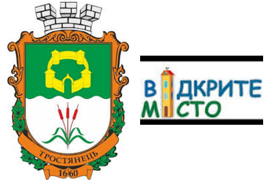

*Тростянець.* У місті Тростянець запроваджено наступні інструменти е-
демократії: веб-платформа «Відкрите місто» (у співпраці з ГО «Голос громади»),
портал для електронних петицій до органів місцевого самоврядування, електронне
голосування у міській раді, запроваджено онлайн трансляцію сесій міської ради,
засідань виконавчого комітету, комісій.

Окрім цього, Тростянецька міська рада спільно з ГО «Голос громади» реалізовували
проект «Активізація участі громадян м. Тростянець Сумської області у місцевому
розвитку через створення квартальних комітетів та дієвої системи громадського
моніторингу». В ході реалізації проекту було створено ефективну модель взаємодії
громадян з органами влади для вирішення актуальних місцевих проблем за допомогою
впровадження веб-платформи «Відкрите місто», як наслідок зменшилась кількість
звернень до міської ради з приводу житлово-комунальних питань, а також кількість
особистих звернень до міського голови під час особистого прийому, що свідчить
про оперативне вирішення питань городян через веб- платформу «Відкрите місто».

У місті Тростянець запроваджена практика здійснення інформування городян про
важливі події міста, а саме: проведення культурних та спортивних заходів,
громадських слухань, зборів квартальних комітетів, проведення сесій, засідань
виконавчого комітету та інше шляхом здійснення розсилки SMS – повідомлень.

В цілому, багато міст України впроваджують надзвичайно цікаві, інноваційні
проекти, сприяють розвитку демократії на місцях за допомогою активного
використання інструментів е-демократії. Кожне місто обирає власну стратегію та
візію розвитку, враховуючи історичні, культурні особливості.

[43]: OpenWorld [Електронний ресурс]. – Режим доступу: http://www.kyivsmartcity.com/projects/openworld/

Додаток 2. Інфографіка сервісів е-демократії у містах України
-------------------------------------------------------------

*Марія Довбенко*

**Малюнок 1. Е-інструменти та е-портали в обласних центрах і столиці України
(2016 рік)**

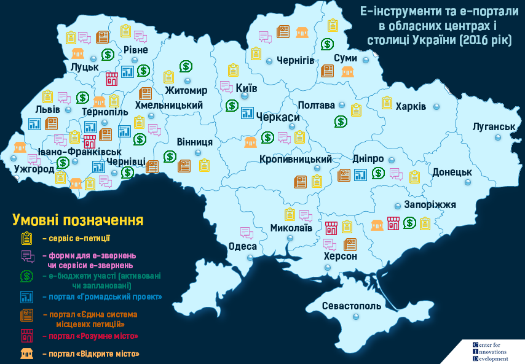

Інфографіка демонструє е-інструменти та е-портали, якими користуються міста.
Аналіз здійснювався на основі моніторингу офіційних веб-сайтів міських рад у 24
обласних центрах і столиці України, порталів «Єдина система місцевих петицій»,
«Розумне місто», «Відкрите місто» та «Громадський проект».

**Малюнок 2. Сервіси е-петицій в обласних центрах і столиці України (2016 рік)**

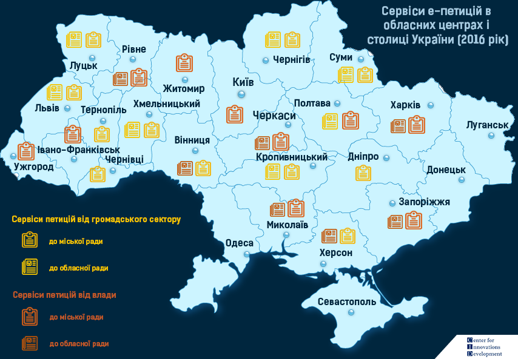

Інфографіка демонструє, які обласні та міські ради у адміністративних центрах
запровадили сервіси петицій. Ці сервіси розмежовано за принципом влада та
громадянський сектор. Сервіс від влади – це сервіс, який функціонує на
офіційному веб-сайті місцевої ради. Сервіс від громадянського сектора – це
сервіс, який функціонує в рамках порталу «Єдина система місцевих петицій» як
частина програми EGAP та виконується Фондом Східна Європа і Фондом InnovaBridge.
Аналіз здійснювався на основі моніторингу веб-сайтів міських рад обласних
центрів та обласних рад та порталу «Єдина система місцевих петицій».

**Малюнок 3. Топ-теми е-петицій в обласних центрах і столиці України (2016
рік)**

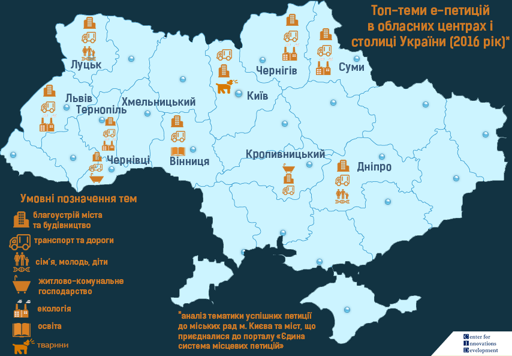

Інфографіка демонструє, які три топ-теми популярні по містах України. Топ-теми
визначалися серед успішних петицій (ті, які отримали необхідну кількість голосів
для розгляду). Аналіз проводився на основі моніторингу сервісів петицій міських
рад адміністративних центрів України, що приєдналися до порталу «Єдиної системи
місцевих петицій», та сайту Київської міської ради.

**Малюнок 4. Результати роботи «Єдиної системи місцевих петицій» (лютий 2017
року)**

Інфографіка демонструє структуру петицій по територіальним громадам України, які
приєдналися до Єдиної системи місцевих петицій: загальна кількість і розподіл по
громадам, кількість голосів та тематика звернень. Інфографіка охоплює жовтень
2015 - лютий 2017 року.

**Малюнок 5. Статистика е-петицій до Київради (лютий 2017 року)**

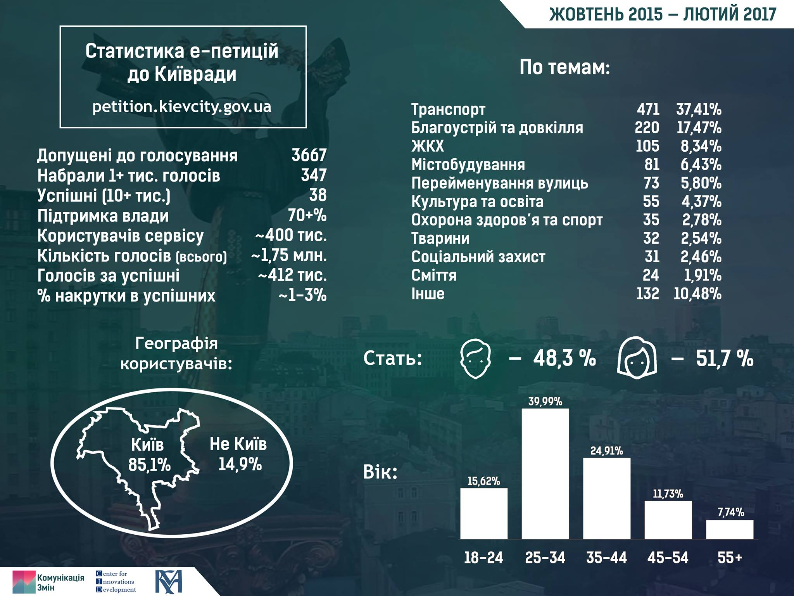

На інфографіці відображено ключові статистичні дані по петиціях за жовтень 2015
– лютий 2017 року: кількість успішних петицій, голосів та рівень накрутки в
успішних петиціях, зріз за тематикою, віком, статтю та географією.

**Малюнок 6. Петиції на порталі «Розумне місто» (січень 2017 року)**

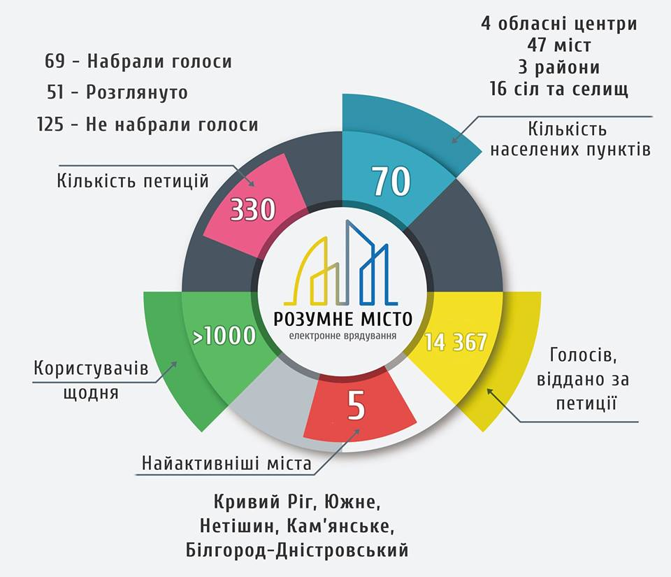

Інфографіка відображає статистичні показники по роботі модулю електронних
петицій до порталу «Розумне місто» за березень 2016 – січень 2017 року:
кількість петицій, активність користувачів, голосування та територіальних
громад.

Додаток 3. Довідкова і статистична інформація
---------------------------------------------

*Марія Довбенко, Поліна Завадська, Анна Ємельянова*

**Таблиця 1. Перелік обласних, місцевих та районних рад, де запроваджено місцеві
петиції, та сервіси, які там функціонують**

*Перелік міст, у яких запроваджено сервіс електронних петицій, не є вичерпним,
оскільки що до цієї ініціативи постійно долучаються нові громади.*

Скорочення: ЄСПМ – Єдина система місцевих петицій РМ – портал «Розумне місто» СР
– сайт місцевої ради П – положення розроблено, немає технічного рішень

| Обласні ради | Вінницька (СР)                                                                                                                                                                                                                | Волинська (ЄСМП)                                                                                                                                                                  | Дніпропетровська (ЄСМП)                                                                                                                                                            |
|--------------|-------------------------------------------------------------------------------------------------------------------------------------------------------------------------------------------------------------------------------|-----------------------------------------------------------------------------------------------------------------------------------------------------------------------------------|------------------------------------------------------------------------------------------------------------------------------------------------------------------------------------|
| Міські ради  | Вінниця(ЄСМП) Жмеринка(ЄСМП) Липовець(ЄСМП) Якушинці(ЄСМП)                                                                                                                                                                    | Благодатне(ЄСМП) Володимир-Волинський(ЄСМП) Жидичин(ЄСМП) Луцьк(ЄСМП) Нововолинськ(ЄСМП) Ратнівський(ЄСМП)                                                                        | Дніпро(ЄСМП) Єлизаветівка (РМ) Жовті Води(ЄСМП) Кам'янське(ЄСМП) Кривий Ріг (СР) Нікополь(ЄСМП) Павлоград(ЄСМП) Синельникове(ЄСМП)                                                 |
| Районні ради | Бершадський (ЄСМП)                                                                                                                                                                                                            | Володимир-Волинський(ЄСМП) Ратнівський(ЄСМП)                                                                                                                                      |                                                                                                                                                                                    |

| Обласні ради | Донецька (немає)                                                                                                                                                                                                              | Житомирська (немає)                                                                                                                                                               | Закарпатська (немає)                                                                                                                                                               |
|--------------|-------------------------------------------------------------------------------------------------------------------------------------------------------------------------------------------------------------------------------|-----------------------------------------------------------------------------------------------------------------------------------------------------------------------------------|------------------------------------------------------------------------------------------------------------------------------------------------------------------------------------|
| Міські ради  | Авдіївка(ЄСМП) Бахмут(ЄСМП) Добропілля (СР) Дружківка (РМ) Іллінівка (РМ) Констянтинівка(РМ) Краматорськ(ЄСМП) Маріуполь(ЄСМП) Миколаївка(ЄСМП) Новогродівка (РМ) Покровськ (РМ) Селидове (РМ) Слов’янськ(ЄСМП) Соледар(ЄСМП) | Бердичів (РМ) Житомир (СР) Коростишів(ЄСМП) Новоград-Волинський(ЄСМП)                                                                                                             | Іршава (РМ) Ужгород (СР)                                                                                                                                                           |
| Районні ради | Харківський (ЄСМП)                                                                                                                                                                                                            | Андрушівський(ЄСМП) Житомирський(ЄМСП) Овруцький(ЄСМП) Пулинський(ЄСМП)                                                                                                           |                                                                                                                                                                                    |

| Обласні ради | Запорізька (СР)                                                                                                                                                                                                               | Івано-Франківська (немає)                                                                                                                                                         | Київська (немає)                                                                                                                                                                   |
|--------------|-------------------------------------------------------------------------------------------------------------------------------------------------------------------------------------------------------------------------------|-----------------------------------------------------------------------------------------------------------------------------------------------------------------------------------|------------------------------------------------------------------------------------------------------------------------------------------------------------------------------------|
| Міські ради  | Енергодар(ЄСМП) Запоріжжя (СР) Мелітополь (РМ) Оріхів(ЄСМП) Пологи (РМ) Приморськ(ЄСМП) Токмак (РМ)                                                                                                                           | Брошнів-Осада (РМ) Долина(ЄСМП) Івано-Франківськ(СР) Калуш(ЄСМП) Коломия(ЄСМП) Тисменеця (РМ) Яремче (РМ)                                                                         | Васильків (РМ) Вишгород(ЄСМП) Вишневе (СР) Гостомель(ЄСМП) Ірпінь(ЄСМП) Київ (СР) Обухів(ЄСМП) Переяслав-Хмельницький(ЄСМП) Сквира (РМ) Славутич(ЄСМП) Українка(ЄСМП) Фастів(ЄСМП) |
| Районні ради | Запорізька (СР)                                                                                                                                                                                                               | Коломийський (ЄСМП)                                                                                                                                                               | Київська (немає)                                                                                                                                                                   |

| Обласні ради | Кіровоградська (ЄСМП)                                                                                                                                                                                                         | Луганська (немає)                                                                                                                                                                 | Львівська(ЄСМП)                                                                                                                                                                    |
|--------------|-------------------------------------------------------------------------------------------------------------------------------------------------------------------------------------------------------------------------------|-----------------------------------------------------------------------------------------------------------------------------------------------------------------------------------|------------------------------------------------------------------------------------------------------------------------------------------------------------------------------------|
| Міські ради  | Знам’янка(ЄСМП) Кропивницький(ЄСМП) Світловодськ(ЄСМП)                                                                                                                                                                        | Лисичанськ(ЄСМП) Попасна(ЄСМП) Рубіжне (РМ) Сєвєродонецьк (РМ)                                                                                                                    | Броди(ЄСМП) Дрогобич(ЄСМП) Жидачів (РМ) Кам’янка-Бузька(ЄСМП) Львів(ЄСМП) Пустомити(ЄСМП) Самбір(ЄСМП) Стрий(ЄСМП) Трускавець(ЄСМП) Яворів(ЄСМП)                                   |
| Районні ради | Кіровський(ЄСМП) Олександрівський(ЄСМП) Петрівський(ЄСМП) Світловодський(ЄСМП)                                                                                                                                                | Луганська (немає)                                                                                                                                                                 | Самбірський(ЄСМП) Яворівський(ЄСМП)                                                                                                                                                |

| Обласні ради | Миколаївська (СР)                                                                                                                                                                                                             | Одеська(немає)                                                                                                                                                                    | Полтавська (ЄСМП)                                                                                                                                                                  |
|--------------|-------------------------------------------------------------------------------------------------------------------------------------------------------------------------------------------------------------------------------|-----------------------------------------------------------------------------------------------------------------------------------------------------------------------------------|------------------------------------------------------------------------------------------------------------------------------------------------------------------------------------|
| Міські ради  | Ірпінь(ЄСМП) Миколаїв (СР) Обухів(ЄСМП) Первомайськ (СР) Переяслав-Хмельницький(ЄСМП)                                                                                                                                         | Арциз (РМ) Білшород-Дністровський (РМ) Болград (РМ) Комінтернівське (РМ) Миколаївка (РМ) Одеса (П) Овідіополь(ЄСМП) Рені (РМ) Теплодар (РМ) Чорноморськ(ЄСМП) Шабо (РМ) Южне (РМ) | Горішні Плавні(ЄСМП) Кременчук (СР) Лохвиця(ЄСМП) Миргород(ЄСМП) Пирятин (РМ) Полтава (СР)                                                                                         |
| Районні ради | Обухів(ЄСМП) Переяслав-Хмельницький(ЄСМП)                                                                                                                                                                                     | Балтський (РМ)                                                                                                                                                                    | Миргородський(ЄСМП) Решитилівський(ЄСМП)                                                                                                                                           |

| Обласні ради | Рівненська (СР)                                                                                                                                                                                                               | Сумська (ЄСПМ)                                                                                                                                                                    | Тернопілська (немає)                                                                                                                                                               |
|--------------|-------------------------------------------------------------------------------------------------------------------------------------------------------------------------------------------------------------------------------|-----------------------------------------------------------------------------------------------------------------------------------------------------------------------------------|------------------------------------------------------------------------------------------------------------------------------------------------------------------------------------|
| Міські ради  | Гоща (РМ) Дубно(ЄСМП) Здолбунів(ЄСМП) Зоря (РМ) Квасилів (РМ) Клевань (РМ) Костопіль (РМ) Кузнецовськ(ЄСМП) Оржів (РМ) Острог(ЄСМП) Радивилів(ЄСМП) Рівне (СР) Смига (РМ)                                                     | Білопілля (ЄСПМ) Конотоп (ЄСПМ) Ромни (ЄСПМ) Суми (ЄСПМ) Тростянець (ЄСПМ)                                                                                                        | Збараж(ЄСМП) Заліщики(ЄСМП) Ланівці(ЄСМП) Тернопіль(ЄСМП) Хоростків(ЄСМП)                                                                                                          |
| Районні ради | Дубенський (РМ) Костопільський(ЄСМП)                                                                                                                                                                                          |                                                                                                                                                                                   |                                                                                                                                                                                    |

| Обласні ради | Харківська (СР)                                                                                                                                                                                                               | Херсонська (СР)                                                                                                                                                                   | Хмельницька (ЄСПМ)                                                                                                                                                                 |
|--------------|-------------------------------------------------------------------------------------------------------------------------------------------------------------------------------------------------------------------------------|-----------------------------------------------------------------------------------------------------------------------------------------------------------------------------------|------------------------------------------------------------------------------------------------------------------------------------------------------------------------------------|
| Міські ради  | Введенка (РМ) Ізюм(ЄСМП) Харків (СР) Люботин (РМ) Мерефа (РМ)                                                                                                                                                                 | Дніпряни(ЄСМП) Каланчак (РМ) Каховка(ЄСМП) Херсон(ЄСМП)                                                                                                                           | Деражня (ЄСПМ) Камянецьк-Подільськ (СР) Нетішин (СР) Славута (ЄСПМ) Староконстянтинів(ЄСПМ) Хмельницький(ЄСПМ)                                                                     |
| Районні ради | Харківська (СР)                                                                                                                                                                                                               | Херсонська (СР)                                                                                                                                                                   | Хмельницький (ЄСПМ)                                                                                                                                                                |

| Обласні ради | Черкаська (СР)                                                                                                                                                                                                                | Чернівецька (немає)                                                                                                                                                               | Чернігівська (ЄСМП)                                                                                                                                                                |
|--------------|-------------------------------------------------------------------------------------------------------------------------------------------------------------------------------------------------------------------------------|-----------------------------------------------------------------------------------------------------------------------------------------------------------------------------------|------------------------------------------------------------------------------------------------------------------------------------------------------------------------------------|
| Міські ради  | Звенигородка(ЄСМП) Золотоноша(ЄСМП) Жашків(ЄСМП) Корсунь-Шевченківський(ЄСМП) Черкаси (СР) Умань(ЄСМП)                                                                                                                        | Вижниця(ЄСМП) Заставна(ЄСМП) Кіцмань(ЄСМП) Чернівці(ЄСМП)                                                                                                                         | Корюківка (ЄСМП) Мена(ЄСМП) Ніжин(ЄСМП) Олександрівка(ЄСМП) Сосниця(ЄСМП) Семенівка (РМ) Чернігів(ЄСМП)                                                                            |
| Районні ради |                                                                                                                                                                                                                               |                                                                                                                                                                                   | Чернігівська(ЄСМП)                                                                                                                                                                 |

**Таблиця 2. Топ-теми петицій по містах України (за кількістю петицій)**[44]

| Теми                               | Кропивницький | Суми  | Вінниця   | Хмельницький |
|------------------------------------|---------------|-------|-----------|--------------|
| Благоустрій міста та будівництво   | 3             | 30    | 88        | 18           |
| Екологія                           | 0             | 9     | 8         | 3            |
| Економіка та фінанси               | 0             | 0     | 0         | 0            |
| Житлово-комунальне господарство    | 6             | 1     | 4         | 1            |
| Земельні відносини                 | 0             | 0     | 1         | 1            |
| Освіта                             | 1             | 1     | 9         | 9            |
| Охорона здоров’я                   | 1             | 0     | 3         | 2            |
| Охорона правопорядку               | 0             | 2     | 2         | 0            |
| Промисловість та підприємництво    | 0             | 0     | 0         | 0            |
| Сім’я, молодь, діти                | 0             | 0     | 3         | 1            |
| Соціальний захист та охорона праці | 0             | 0     | 2         | 0            |
| Транспорт та дороги                | 1             | 19    | 69        | 6            |

| Теми                               | Луцьк         | Львів | Тернопіль | Чернівці     | Дніпро | Чернігів |
|------------------------------------|---------------|-------|-----------|--------------|--------|----------|
| Благоустрій міста та будівництво   | 32            | 5     | 39        | 31           | 6      | 51       |
| Екологія                           | 2             | 4     | 3         | 2            | 0      | 11       |
| Економіка та фінанси               | 1             | 1     | 1         | 0            | 1      | 2        |
| Житлово-комунальне господарство    | 1             | 2     | 2         | 5            | 0      | 9        |
| Земельні відносини                 | 1             | 0     | 0         | 1            | 1      |          |
| Освіта                             | 5             | 0     | 1         | 0            | 0      | 3        |
| Охорона здоров’я                   | 1             | 0     | 1         | 3            | 0      | 6        |
| Охорона правопорядку               | 1             | 1     | 1         | 0            | 0      | 7        |
| Промисловість та підприємництво    | 1             | 0     | 2         | 1            | 0      | 0        |
| Сім’я, молодь, діти                | 6             | 2     | 3         | 4            | 2      | 2        |
| Соціальний захист та охорона праці | 4             | 1     | 0         | 2            | 0      | 1        |
| Транспорт та дороги                | 21            | 5     | 12        | 5            | 3      | 30       |

 [44]: На основі моніторингу успішних петицій на порталі «Єдиної системи місцевих петицій» 31.01.2017

**Таблиця 3.Топ-теми петицій по містах України (у відсотковому відношенні)**[45]

| Теми                               | Луцьк         | Львів | Тернопіль | Чернівці     | Дніпро | Чернігів |
|------------------------------------|---------------|-------|-----------|--------------|--------|----------|
| Благоустрій міста та будівництво   | 42%           | 24%   | 60%       | 58%          | 46%    | 41%      |
| Екологія                           | 3%            | 19%   | 5%        | 4%           | 0%     | 9%       |
| Економіка та фінанси               | 1%            | 5%    | 2%        | 0%           | 8%     | 2%       |
| Житлово-комунальне господарство    | 1%            | 10%   | 3%        | 9%           | 0%     | 7%       |
| Земельні відносини                 | 1%            | 0%    | 0%        | 0%           | 8%     | 1%       |
| Освіта                             | 7%            | 0%    | 2%        | 0%           | 0%     | 2%       |
| Охорона здоров’я                   | 1%            | 0%    | 2%        | 6%           | 0%     | 5%       |
| Охорона правопорядку               | 1%            | 5%    | 2%        | 0%           | 0%     | 6%       |
| Промисловість та підприємництво    | 1%            | 0%    | 3%        | 2%           | 0%     | 0%       |
| Сім’я, молодь, діти                | 8%            | 10%   | 5%        | 8%           | 15%    | 2%       |
| Соціальний захист та охорона праці | 5%            | 5%    | 0%        | 4%           | 0%     | 1%       |
| Транспорт та дороги                | 28%           | 24%   | 18%       | 9%           | 23%    | 24%      |

| Теми                               | Кропивницький | Суми  | Вінниця   | Хмельницький |
|------------------------------------|---------------|-------|-----------|--------------|
| Благоустрій міста та будівництво   | 25%           | 48%   | 47%       | 44%          |
| Екологія                           | 0%            | 15%   | 4%        | 7%           |
| Економіка та фінанси               | 0%            | 0%    | 0%        | 0%           |
| Житлово-комунальне господарство    | 50%           | 2%    | 2%        | 2%           |
| Земельні відносини                 | 0%            | 0%    | 1%        | 2%           |
| Освіта                             | 8%            | 2%    | 5%        | 22%          |
| Охорона здоров’я                   | 8%            | 0%    | 2%        | 5%           |
| Охорона правопорядку               | 0%            | 3%    | 1%        | 0%           |
| Промисловість та підприємництво    | 0%            | 0%    | 0%        | 0%           |
| Сім’я, молодь, діти                | 0%            | 0%    | 2%        | 2%           |
| Соціальний захист та охорона праці | 0%            | 0%    | 1%        | 0%           |
| Транспорт та дороги                | 8%            | 31%   | 37%       | 15%          |

[45]: На основі моніторингу успішних петицій на порталі «Єдиної системи місцевих петицій» 

**Таблиця 4. Топ-теми петицій у місті Києві**[46]

| Тема                              | Кількість петицій | У відсотковому відношенні |
|-----------------------------------|-------------------|---------------------------|
| Благоустрій та довкілля           | 10                | 31%                       |
| Містобудування                    | 6                 | 19%                       |
| Тварини                           | 4                 | 13%                       |
| Транспорт                         | 3                 | 9%                        |
| МАФи та стихійна торгівля         | 2                 | 6%                        |
| Соціальний захист                 | 2                 | 6%                        |
| Перейменування вулиць             | 1                 | 3%                        |
| Дорожнє господарство              | 1                 | 3%                        |
| Житлово-комунальна інфраструктура | 1                 | 3%                        |
| Культура та освіта                | 1                 | 3%                        |
| Сміття                            | 1                 | 3%                        |
| Охорона здоров'я та спорт         | 0                 | 0%                        |

[46]: На основі моніторингу успішних петицій на веб-сайті Київської міської ради станом на 31.01.2017 

**Таблиця 5. Перелік міст, де було впроваджено громадський бюджет (участі) (2016 рік)**

*Перелік міст, у яких запроваджено Бюджет участі не претендує на вичерпність,
враховуючи, що до цієї ініціативи постійно долучаються нові українські міста.*

| № з/п | Назва міста      | Назва ініціативи                     | Посилання                                                                                                 | Подати проект можна онлайн | Е-голосування\* |
|-------|------------------|--------------------------------------|-----------------------------------------------------------------------------------------------------------|----------------------------|-----------------|
| 1     | Бердичів         | Бюджет участі                        | http://gromada.berdychiv.com.ua/                                                                          | \+                         | 0%              |
| 2     | Бердянськ        | Бюджет міських ініціатив             | https://berdiansk.pb.org.ua/                                                                              | \+                         | 50%             |
| 3     | Бровари          | Бюджет участі (громадський бюджет)   | http://brovaryrada.gov.ua/documents/24573.html                                                            | \+                         | 0%              |
| 4     | Дніпро           | Бюджет участі                        | https://adm.dniprorada.gov.ua/about                                                                       | \+                         | 50%             |
| 5     | Вінниця          | Бюджет громадських ініціатив         | http://gromada.vmr.gov.ua/default.aspx                                                                    | \+                         | 0%              |
| 6     | Житомир          | Бюджет участі                        | http://gromada.ztrada.gov.ua/                                                                             | \+                         | 50%             |
| 7     | Запоріжжя        | Громадський бюджет                   | http://gb.meriazp.gov.ua/uk                                                                               | \+                         | 50%             |
| 8     | Івано-Франківськ | Бюджет участі                        | http://bu.mvk.if.ua/                                                                                      | \+                         | 0%              |
| 9     | Ірпінь           | Громадський бюджет                   | https://imr.gov.ua/gromadskij-byudzhetirpin                                                               | \+                         | 50%             |
| 10    | Канів            | Громадський бюджет                   | http://kanivrada.gov.ua/pages.php?p=274                                                                   | \-                         | 50%             |
| 11    | Київ             | Громадський бюджет                   | https://gb.kievcity.gov.ua/                                                                               | \+                         | 100%            |
| 12    | Краматорськ      | Бюджет міських ініціатив             | https://kramatorsk.pb.org.ua/                                                                             | \+                         | 50%             |
| 13    | Кременчук        | Громадський бюджет                   | https://budget.kremen.org.ua/info/project                                                                 | \-                         | 100%            |
| 14    | Кривий Ріг       | Громадський бюджет                   | http://gb.kr.gov.ua/                                                                                      | \-                         | 50%             |
| 15    | Луцьк            | Громадський бюджет                   | http://initiativ.edem.in.ua/lutsk/in                                                                      | \+                         | 100%            |
| 16    | Львів            | Бюджет міських ініціатив             | https://lviv.pb.org.ua/                                                                                   | \+                         | 100%            |
| 17    | Мелітополь       | Бюджет міських ініціатив             | https://melitopolonline.gov.ua/                                                                           | \+                         | 100%            |
| 18    | Нікополь         | Бюджет участі                        | http://www.nikopolmrada.dp.gov.ua/news/u-nikopoli-diiemiska-tsilovaprohramapartytsypatornebiudzhetuvannia | \-                         | 100%            |
| 19    | Новопсков        | Бюджет участі                        | http://novopskovrada.gov.ua/bjudzhetuchasti-16-06-54-02-11-2016/                                          | \-                         | 0%              |
| 20    | Обухів           | Бюджет участі                        | http://budget.obukhiv.kiev.ua                                                                             | \+                         | 0%              |
| 21    | Полтава          | Громадський бюджет                   | http://www.radapoltava.gov.ua/people/parcutupator/                                                        | \+                         | 50%             |
| 22    | Прилуки          | Громадський (партисипаторний) бюджет | http://initiativ.edem.in.ua/pryluky/Competition/View/1                                                    | \+                         | 100%            |
| 23    | Рівне            | Бюджет міських ініціатив             | https://rivne.pb.org.ua/                                                                                  | \+                         | 100%            |
| 24    | Ромни            | Громадський бюджет                   | http://romny.ospua.info/?ch=3&fl=mbudj_hb_fp                                                              | \-                         | 0%              |
| 25    | Суми             | Громадський бюджет                   | http://initiativ.edem.in.ua/sumy/in                                                                       | \-                         | 100%            |
| 26    | Тернопіль        | Бюджет міських ініціатив             | https://pb.rada.te.ua                                                                                     | \+                         | 100%            |
| 27    | Тетіїв           | Громадський бюджет                   | http://tetiivmiskrada.org.ua/rishennya2/pro-zaprovadzhenniahromadskohobiudzhetu-mistatetiieva.html        | \+                         | 50%             |
| 28    | Ужгород          | Громадський бюджет                   | http://radauzhgorod.gov.ua/gromadskyj-byudzhet-2/                                                         | \+                         | 100%            |
| 29    | Хмельницький     | Бюджет міських ініціатив             | https://gp.khm.gov.ua/                                                                                    | \+                         | 100%            |
| 30    | Черкаси          | Громадський бюджет                   | http://www.rada.cherkasy.ua/ua/sections.php?s=34                                                          | \+                         | 50%             |
| 31    | Чернівці         | Бюджет міських ініціатив             | https://gb.city.cv.ua                                                                                     | \+                         | 100%            |
| 32    | Чернігів         | Бюджет участі                        | http://www.chernigivrada.gov.ua//news/view/7267                                                           | \-                         | 50%             |

* У деяких містах з онлайн-голосуванням ідентифікація відбувається через завантаження сканованих паспортів громадянина України. Рекомендуємо для е-голосування технології, які дають точну ідентифікацію та легалізовані в Україні: ЕЦП, БанкІД, е-паспорт, а також - картка містянина (якщо налагоджено роботу е- кабінетіа їх власників), МобайлІД (законопроект схвалений у першому читанні).

**Платформи е-участі в Україні**

*Перелік міст із платформами е-участі та контактними центрами органів влади є
умовно вичерпним на момент написання цього довідника.*

**Smart City**

*Перелік міст «Smart City» з посиланнями:*

Київ <http://www.kyivsmartcity.com/>

Дніпро <https://dniprocity.gov.ua/>

**Розумне місто**

Посилання на портал: <http://www.rozumnemisto.org/> *Перелік міст і громад, для
яких працює портал «Розумне місто»:*

1.  Арциз

2.  Бердичів

3.  Білгород-Дністровський

4.  Болград

5.  Брошнів-Осада

6.  Васильків

7.  Введенка

8.  Вишгород

9.  Володимир-Волинський

10. Гоща

11. Дрогобич

12. Дружківка

13. Дубно

14. Єлизаветівка

15. Жидачів

16. Жовті Води

17. Запоріжжя

18. Здолбунів

19. Зоря

20. Іллінівська ОТГ

21. Іршава

22. Каланчак

23. Кам'янське

24. Квасилів

25. Клевань

26. Комінтернівське

27. Костянтинівка

28. Кривий Ріг

29. Люботин

30. Маріуполь

31. Мелитополь

32. Мерефа

33. Миколаївка

34. Нетішин

35. Новогродівка

36. Оржів

37. Острог

38. Пирятин

39. Покровськ

40. Пологи

41. Радивилів

42. Рені

43. Решетилівка

44. Рівне

45. Рубіжне

46. Світловодськ

47. Северодонецьк

48. Селідове

49. Семенівка

50. Сквира

51. Славута

52. Слов'янськ

53. Смизька ОТГ

54. Сосниця

55. Теплодар

56. Тернопіль

57. Тисмениця

58. Токмак

59. Трускавець

60. Херсон

61. Шабо

62. Южне

63. Яремче

**Відкрите місто**

Посилання на портал: <http://opencity.in.ua/>

*Перелік міст і громад, для яких працює портал «Відкрите місто»:*

1.  Балта
2.  Бар
3.  Бровари
4.  Бурштин
5.  В. Березний
6.  Вараш
7.  Веселе
8.  Вижниця
9.  Вільнянськ
10. Воскресенка
11. Глибока
12. Добротвір
13. Долина
14. Дрогобич
15. Дунаївці
16. Енергодар
17. Запоріжжя
18. Кам'янка-Бузька
19. Карлівка
20. Коломия
21. Луцьк
22. Мелітополь
23. Миргород
24. Молочанськ
25. Мукачеве
26. Немішаєве
27. Нікополь
28. Новояворівськ
29. Павлоград
30. Перечин
31. Приморськ
32. Самбір
33. Сарни
34. Скадовськ
35. Славута
36. Суми
37. Тернопіль
38. Тростянець
39. Ужгород
40. Фастів
41. Хмельницький
42. Черкаси
43. Чернівці
44. Чернігів
45. Чоп
46. Яворів

**Таблиця 6. Інтернет-портали контактних центрів органів виконавчої влади**

| № п/п | Регіон                   | Назва контактного центру                                                           | Сайт                                            |
|-------|--------------------------|------------------------------------------------------------------------------------|-------------------------------------------------|
| 1.    | Дніпропетровська область | Дніпропетровський обласний контактний центр                                        | https://e-contact.dp.gov.ua/                 |
| 2.    | Донецька область         | Комунальна установа «Донецький обласний контактний центр»                          | http://hotline.dn.gov.ua/                       |
| 3.    | Житомирська область      | Житомирський обласний контактний центр                                             | http://okc.zt.ua/                               |
| 4.    | м. Одеса                 | Єдиний центр звернень громадян Одеської міської ради                               | https://1535.odessa.ua                          |
| 5.    | м. Покровськ             | Контакт-центр м. Покровськ                                                         | http://pokrovsk.bissoft.org/                    |
| 6.    | Полтавська область       | Комунальна бюджетна установа «Обласний контактний центр» Полтавської обласної ради | http://pl-oblasniy-kontaktniy-centr.blogspot.com/         |
| 7.    | м. Селідово              | Контакт-центр м. Селідове                                                          | http://selidovo.bissoft.org/                    |
| 8.    | м. Київ                  | Комунальна бюджетна установа «Контактний центр міста Києва»                        | http://1551.gov.ua/                             |
